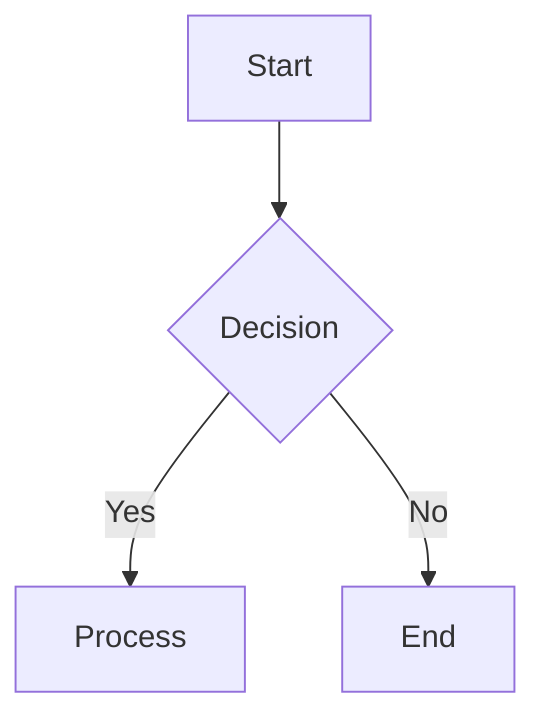
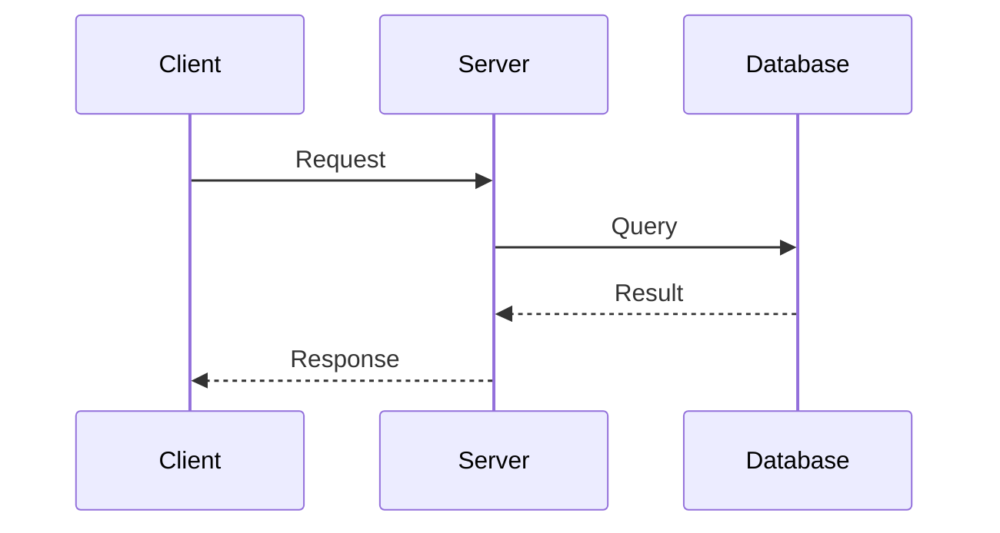
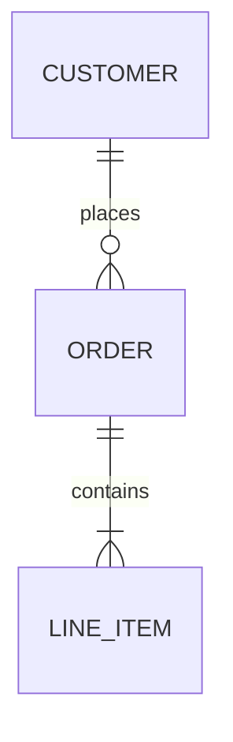

# Mermaid Standards

## 1. Diagram Types

- **Flowchart**: Process and logic flow (`flowchart TD`).
- **Sequence**: Interaction flows between actors.
- **ERD**: Database schemas and data models.
- **Class**: Object-oriented design.

### Example: Flowchart

**Good**

### Example: Sequence

**Good**

## 2. Syntax Best Practices

- **Quote Labels**: Use `id["Label (with parens)"]` for special characters.
- **No HTML**: Avoid HTML tags in labels.
- **Subgraphs**: Group related nodes for organization.

### Example: ERD

**Good**

## 3. Validation

- **Compile Check**: Run `npx @mermaid-js/mermaid-cli mmdc -i input.md -o output.svg`.
- **Preview**: Use VS Code Mermaid Preview extension.

## 4. Documentation Use

- **Architecture**: Use flowcharts for system architecture.
- **API Flows**: Use sequence diagrams for API documentation.
- **Data Models**: Use ERDs for database documentation.
