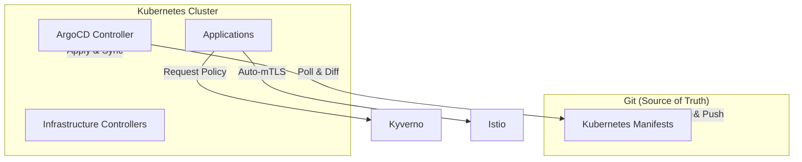

# System Architecture

This document defines the high-level design, structural principles, and technology stack alignment for the `hy-home.k8s` project.

---

## 1. Design Principles

- **GitOps-First**: The source of truth resides in Git. Cluster state is continuously reconciled with the desired state defined in this repository.
- **Declarative Infrastructure**: Everything from core controllers to application deployments is defined using YAML manifests (Kustomize/Helm).
- **Immutable Operations**: Changes are promoted via Git commits rather than imperative commands.
- **AI-Optimized**: Repository structure and metadata are optimized for autonomous agent reasoning and execution.

---

## 2. Global Strategy (The 4 Layers)

The system is organized into four distinct logical layers to ensure clear separation of concerns:

1. **Agent Layer**: Defined in [`.agent/`](file:///d:/hy-home.k8s/.agent). Contains the "brains" of the platform—AI rules, workflows, and specialized skills that allow AI agents to maintain and evolve the system autonomously.
2. **Governance Layer**: Defined in [`.agent/`](file:///d:/hy-home.k8s/.agent) and [`docs/standards/`](file:///d:/hy-home.k8s/docs/standards). Contains Architectural Decision Records (ADRs), naming conventions, and security policies.
3. **Application Layer**: Defined in [`apps/`](file:///d:/hy-home.k8s/apps). Contains the business logic and domain entities. See [Application Architecture](file:///d:/hy-home.k8s/docs/applications/README.md).
4. **Infrastructure Layer**: Defined in [`infrastructure/`](file:///d:/hy-home.k8s/infrastructure). The foundational platform services. See [Infrastructure Docs](file:///d:/hy-home.k8s/docs/infrastructure/README.md).

---

## 3. Technology Stack

### Core Orchestration

- **Kubernetes**: The container orchestration engine.
- **ArgoCD**: The GitOps CD tool that syncs this repository to the cluster.
- **Kustomize**: Template-free manifest customization.

### Networking & Service Mesh

- **Istio**: Provides the Service Mesh layer for:
  - **mTLS**: Automatic encryption for all in-cluster traffic.
  - **Traffic Management**: Canary rollouts (via Argo Rollouts), circuit breaking, and Retries.
  - **Ingress Gateway**: Central entry point for external traffic.
- **MetalLB**: Provides LoadBalancer services for bare-metal/home-lab environments.

### Observability (LGTM Stack)

- **Loki**: Centralized log aggregation.
- **Prometheus / Mimir**: Metric collection and storage.
- **Tempo**: Distributed tracing.
- **Grafana**: Unified dashboarding and visualization for all telemetry.
- **Grafana Alloy**: The telemetry collector/agent.

### Security & Compliance

- **Kyverno**: Kubernetes-native policy engine for governance and security enforcement.
- **Sealed Secrets**: Encrypted secrets stored safely in Git.
- **Cert-manager**: Automated X.509 certificate management (Let's Encrypt / Vault).

---

## 4. Deployment Lifecycle

---

## 5. Directory Mapping

| Path | Purpose | Layer |
| :--- | :--- | :--- |
| [`/infrastructure/controllers`](file:///d:/hy-home.k8s/infrastructure/controllers) | Ingress, Service Mesh, and LoadBalancing | Infrastructure |
| [`/infrastructure/observability`](file:///d:/hy-home.k8s/infrastructure/observability) | Complete LGTM stack for monitoring | Infrastructure |
| [`/infrastructure/security`](file:///d:/hy-home.k8s/infrastructure/security) | Policies, Secrets, and Certificates | Infrastructure |
| [`/apps/_templates`](file:///d:/hy-home.k8s/apps/_templates) | Reusable blueprints for new services | Application |
| [`/clusters/docker-desktop`](file:///d:/hy-home.k8s/clusters/docker-desktop) | Cluster-specific state and root applications | Application/Infrastructure |
