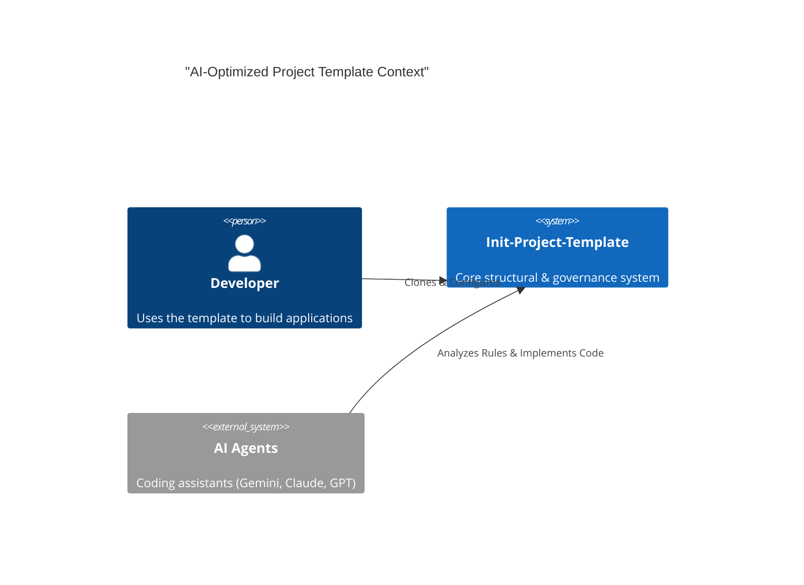

# System Architecture

This document serves as the project-level source of truth for high-level design, structural principles, and technology stack alignment.

## 1. System Context

We utilize the C4 modeling pattern to visualize system boundaries and interactions.

## 2. Technology Stack

| Component | Standard | Governance |
| --- | --- | --- |
| **Orchestration** | Universal Scripts / Make | Language-Agnostic Setup |
| **Pillars** | Markdown-based Rules | Human/Machine parseable standards |
| **Workflows** | .agent/workflows | Declarative automation |
| **Governance** | Coded Identifiers | Deterministic reasoning traceability |

## 3. Structural Standards

All components MUST adhere to the [Architecture Standard (0130)](file:///d:/hy-home.SourceCode/Init-Project-Template/agent_settings/rules/0100-Standards/0130-architecture-standard.md):

- **Directional Dependency**: Presentation -> Domain -> Data.
- **Zero Circularity**: Circular dependencies are prohibited.
- **ADR Governance**: Significant decisions MUST be recorded in `docs/adr/`.

## 4. Logical Layering

1. **Agent Layer**: Rule-driven autonomous execution.
2. **Governance Layer**: Standardized skeletons and identifiers.
3. **Application Layer**: Business logic and domain entities.
4. **Infrastructure Layer**: Deployment & environment management.
