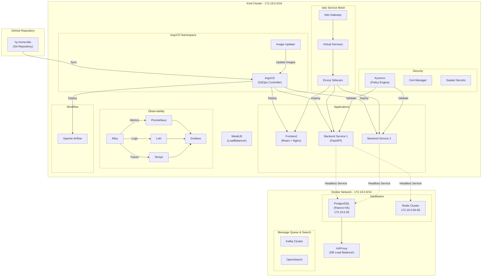

# hy-home.k8s - GitOps 기반 Kubernetes 인프라

이 저장소는 **GitOps** 방법론을 따르는 Kubernetes 인프라 관리 시스템입니다. **ArgoCD**를 사용하여 선언적 방식으로 애플리케이션과 인프라를 배포하며, **Kind (Kubernetes in Docker)** 클러스터 위에서 Docker 컨테이너 기반 외부 서비스와 하이브리드 네트워크를 구성합니다.

## 📋 목차

- [프로젝트 개요](#프로젝트-개요)
- [아키텍처](#아키텍처)
- [디렉토리 구조](#디렉토리-구조)
- [주요 컴포넌트](#주요-컴포넌트)
- [사전 준비](#사전-준비)
- [설치 가이드](#설치-가이드)
- [사용법](#사용법)
- [보안 정책](#보안-정책)
- [외부 서비스 연동](#외부-서비스-연동)
- [트러블슈팅](#트러블슈팅)

## 프로젝트 개요

### 주요 특징

- **GitOps 배포**: ArgoCD를 통한 선언적 배포 및 자동 동기화
- **Canary 배포**: Argo Rollouts를 활용한 점진적 배포 전략
- **Service Mesh**: Istio를 통한 트래픽 관리, mTLS, 관측성
- **하이브리드 네트워크**: Kind 클러스터(172.18.0.0/16)와 Docker 컨테이너(172.19.0.0/16) 간 연동
- **Full-Stack 관측성**: Prometheus, Loki, Tempo, Grafana를 통한 통합 모니터링
- **보안 정책**: Kyverno 기반 정책 엔진 및 자동화된 인증서 관리
- **워크플로우 오케스트레이션**: Apache Airflow

### 기술 스택

- **컨테이너 오케스트레이션**: Kubernetes (Kind)
- **GitOps**: ArgoCD, Argo Rollouts, Argo Image Updater
- **Service Mesh**: Istio
- **관측성**: Prometheus Stack, Loki, Tempo, Grafana, Alloy
- **보안**: Kyverno, Cert-Manager, Sealed Secrets
- **네트워킹**: MetalLB
- **워크플로우**: Apache Airflow
- **외부 서비스**: PostgreSQL (Patroni), Redis Cluster, Kafka, OpenSearch

## 아키텍처



## 디렉토리 구조

```
hy-home.k8s/
├── apps/                           # 비즈니스 애플리케이션
│   ├── backend-service-1/          # 백엔드 서비스 1 (FastAPI)
│   │   ├── base/                   # 기본 매니페스트
│   │   │   ├── rollout.yaml        # Argo Rollout (Canary 배포)
│   │   │   ├── service.yaml        # Kubernetes Service
│   │   │   ├── virtual-service.yaml # Istio VirtualService
│   │   │   ├── hpa.yaml            # Horizontal Pod Autoscaler
│   │   │   ├── pdb.yaml            # Pod Disruption Budget
│   │   │   ├── secret.yaml         # Sealed Secret
│   │   │   └── kustomization.yaml
│   │   └── overlays/               # 환경별 오버레이
│   │       ├── dev/
│   │       └── prod/
│   ├── backend-service-2/          # 백엔드 서비스 2
│   │   └── base/
│   └── frontend/                   # 프론트엔드 (React)
│       └── base/
│           ├── rollout.yaml
│           ├── nginx-configmap.yaml
│           └── ...
│
├── clusters/                       # 클러스터별 배포 설정
│   └── docker-desktop/             # 로컬 Kind 클러스터
│       ├── apps.yaml               # Root Application (App-of-Apps)
│       └── applications/           # ArgoCD Application 정의
│           ├── backend-1.yaml
│           ├── backend-2.yaml
│           └── frontend.yaml
│
├── infrastructure/                 # 인프라 컴포넌트
│   ├── controllers/                # 컨트롤러 및 오퍼레이터
│   │   ├── istio-base/             # Istio CRD
│   │   ├── istio-istiod/           # Istio Control Plane
│   │   ├── istio-gateway/          # Istio Ingress Gateway
│   │   └── metallb/                # MetalLB (LoadBalancer)
│   │
│   ├── external-services/          # 외부 서비스 연동
│   │   ├── postgres/               # PostgreSQL (Headless Service)
│   │   ├── redis/                  # Redis Cluster (Headless Service)
│   │   ├── kafka/                  # Kafka (ServiceEntry)
│   │   ├── opensearch/             # OpenSearch (ServiceEntry)
│   │   ├── kustomization.yaml
│   │   └── egress-policy.yaml      # Istio Egress 정책
│   │
│   ├── observability/              # 관측성 스택
│   │   ├── kube-prometheus-stack/  # Prometheus, Grafana, Alertmanager
│   │   ├── loki/                   # 로그 집계
│   │   ├── tempo/                  # 분산 트레이싱
│   │   ├── alloy/                  # 통합 관측성 에이전트
│   │   └── namespace.yaml
│   │
│   ├── security/                   # 보안 컴포넌트
│   │   ├── cert-manager/           # 인증서 자동 관리
│   │   ├── kyverno/                # 정책 엔진
│   │   │   ├── policies.yaml       # 보안 정책 (Latest 태그 금지, Non-Root 강제)
│   │   │   └── values.yaml
│   │   └── sealed-secrets/         # 암호화된 시크릿 관리
│   │
│   └── workflow/                   # 워크플로우
│       └── airflow/                # Apache Airflow
│
├── certs/                          # TLS 인증서
├── .env                            # 환경 변수
└── README.md                       # 이 문서
```

## 주요 컴포넌트

### 1. GitOps & 배포

#### ArgoCD

- **역할**: Kubernetes 클러스터 상태를 Git 저장소와 자동 동기화
- **App-of-Apps 패턴**: Root Application이 모든 하위 애플리케이션을 관리
- **자동 동기화**: `prune: true`, `selfHeal: true` 설정으로 완전 자동화

#### Argo Rollouts

- **Canary 배포**: 트래픽을 점진적으로 증가시키며 안전한 배포
- **Istio 통합**: VirtualService를 통한 정밀한 트래픽 제어
- **배포 전략**: 20% → 30초 대기 → 50% → 30초 대기 → 100%

#### Argo Image Updater

- **자동 이미지 업데이트**: Docker Hub에서 최신 이미지 감지 및 자동 배포
- **Git Write-back**: 업데이트된 이미지 태그를 Git에 커밋

### 2. Service Mesh & 네트워킹

#### Istio

- **트래픽 관리**: VirtualService, DestinationRule을 통한 정교한 라우팅
- **보안**: mTLS를 통한 서비스 간 암호화 통신
- **관측성**: 자동 메트릭, 로그, 트레이스 수집
- **구성요소**:
  - `istio-base`: CRD 정의
  - `istio-istiod`: Control Plane
  - `istio-gateway`: Ingress Gateway

#### MetalLB

- **로컬 LoadBalancer**: Kind 클러스터에 LoadBalancer IP 제공
- **IP Pool**: `172.18.255.200-172.18.255.250` (50개 IP)
- **L2 Advertisement**: Layer 2 네트워크 모드

### 3. 관측성 (Observability)

#### Kube-Prometheus-Stack

- **Prometheus**: 메트릭 수집 및 저장
- **Grafana**: 통합 시각화 대시보드
- **Alertmanager**: 알림 관리

#### Loki

- **로그 집계**: 분산 로그 수집 및 인덱싱
- **Grafana 통합**: 로그와 메트릭 상관 분석

#### Tempo

- **분산 트레이싱**: 서비스 간 요청 추적
- **OpenTelemetry 호환**: 표준 트레이싱 프로토콜

#### Alloy

- **통합 에이전트**: 메트릭, 로그, 트레이스를 단일 에이전트로 수집
- **효율적 리소스 사용**: 통합 관측성 파이프라인

### 4. 보안 (Security)

#### Kyverno

- **정책 엔진**: Kubernetes 리소스 유효성 검사 및 변형
- **주요 정책**:
  - **Latest 태그 금지**: 가변적인 `:latest` 태그 사용 차단
  - **Non-Root 강제**: 모든 파드를 Non-Root 사용자로 실행
  - **네임스페이스 예외**: `kube-system`, `istio-system` 등 시스템 네임스페이스 제외
- **Enforcement Mode**: 정책 위반 시 배포 차단

#### Cert-Manager

- **자동 인증서 관리**: Let's Encrypt 등을 통한 TLS 인증서 발급 및 갱신
- **ClusterIssuer**: 클러스터 전역 인증서 발급자 정의

#### Sealed Secrets

- **암호화된 시크릿**: Git에 안전하게 저장 가능한 암호화된 Secret
- **공개키 암호화**: 공개키로 암호화, 클러스터 내 개인키로만 복호화

### 5. 워크플로우

#### Apache Airflow

- **DAG 관리**: Python 기반 워크플로우 정의
- **스케줄링**: Cron 기반 작업 스케줄링
- **모니터링**: 웹 UI를 통한 작업 모니터링

### 6. 애플리케이션

#### Backend Service 1 & 2

- **언어/프레임워크**: Python FastAPI
- **배포**: Argo Rollouts (Canary)
- **외부 연동**: PostgreSQL, Redis, Kafka
- **보안**: Non-Root 실행, Istio mTLS
- **리소스**:
  - Requests: CPU 100m, Memory 128Mi
  - Limits: CPU 500m, Memory 512Mi

#### Frontend

- **기술**: React + Nginx
- **배포**: Argo Rollouts (Canary)
- **설정**: ConfigMap을 통한 Nginx 설정 주입
- **리소스**:
  - Requests: CPU 50m, Memory 64Mi
  - Limits: CPU 500m, Memory 256Mi

## 사전 준비

### 필수 소프트웨어

1. **Docker Desktop** (Windows/Mac) 또는 Docker Engine (Linux)
2. **Kind** (Kubernetes in Docker)

   ```bash
   # Windows (PowerShell)
   curl.exe -Lo kind-windows-amd64.exe https://kind.sigs.k8s.io/dl/v0.20.0/kind-windows-amd64
   Move-Item .\kind-windows-amd64.exe C:\Windows\System32\kind.exe
   
   # Linux/Mac
   curl -Lo ./kind https://kind.sigs.k8s.io/dl/v0.20.0/kind-$(uname)-amd64
   chmod +x ./kind
   sudo mv ./kind /usr/local/bin/kind
   ```

3. **kubectl**

   ```bash
   # Windows (PowerShell)
   curl.exe -LO "https://dl.k8s.io/release/v1.28.0/bin/windows/amd64/kubectl.exe"
   Move-Item .\kubectl.exe C:\Windows\System32\kubectl.exe
   
   # Linux/Mac
   curl -LO "https://dl.k8s.io/release/$(curl -L -s https://dl.k8s.io/release/stable.txt)/bin/linux/amd64/kubectl"
   chmod +x ./kubectl
   sudo mv ./kubectl /usr/local/bin/kubectl
   ```

### 하이브리드 네트워크 사전 준비

Kind 클러스터(172.18.0.0/16)와 Docker 컨테이너(172.19.0.0/16)가 통신하려면 라우팅 설정이 필요합니다.

> [!IMPORTANT]
> 이 작업은 Kind 클러스터 생성 **직후** 수행해야 합니다.

```bash
# Docker의 infra_net 게이트웨이 확인 (일반적으로 172.19.0.1)
docker network inspect infra_net | grep Gateway

# Kind 노드에 정적 라우트 추가
docker exec -it desktop-control-plane ip route add 172.19.0.0/16 via 172.18.0.1
docker exec -it desktop-worker ip route add 172.19.0.0/16 via 172.18.0.1
docker exec -it desktop-worker2 ip route add 172.19.0.0/16 via 172.18.0.1
docker exec -it desktop-worker3 ip route add 172.19.0.0/16 via 172.18.0.1
```

## 설치 가이드

### 1. Kind 클러스터 생성

```bash
# Quick setup script example: create Kind cluster with kind-config.yaml
cat > kind-config.yaml <<'EOF'
kind: Cluster
apiVersion: kind.x-k8s.io/v1alpha4
nodes:
  - role: control-plane
  - role: worker
  - role: worker
  - role: worker
EOF

# Create cluster
kind create cluster --config kind-config.yaml --name desktop

# Cluster verification
kubectl cluster-info --context kind-desktop
kubectl get nodes
```

### 2. 하이브리드 네트워크 설정

위의 [하이브리드 네트워크 사전 준비](#하이브리드-네트워크-사전-준비) 섹션의 라우팅 설정을 수행합니다.

### 3. ArgoCD 설치 (Bootstrap)

```bash
# ArgoCD 네임스페이스 생성
kubectl create namespace argocd

# ArgoCD 설치
kubectl apply -n argocd -f https://raw.githubusercontent.com/argoproj/argo-cd/stable/manifests/install.yaml

# ArgoCD CLI 설치 (선택사항)
# Windows
$version = (Invoke-RestMethod https://api.github.com/repos/argoproj/argo-cd/releases/latest).tag_name
$url = "https://github.com/argoproj/argo-cd/releases/download/" + $version + "/argocd-windows-amd64.exe"
Invoke-WebRequest -Uri $url -OutFile argocd.exe
Move-Item .\argocd.exe C:\Windows\System32\argocd.exe

# Linux/Mac
curl -sSL -o argocd https://github.com/argoproj/argo-cd/releases/latest/download/argocd-linux-amd64
chmod +x argocd
sudo mv argocd /usr/local/bin/argocd
```

### 4. Quick setup script (example)

다음은 `kind` 생성, 하이브리드 라우팅, ArgoCD 설치 및 root Application 배포를 한 번에 실행하는 간단한 스크립트 예시입니다. 로컬 환경에 맞게 네트워크 게이트웨이와 노드명을 조정하세요.

```bash
# Create cluster
kind create cluster --config kind-config.yaml --name desktop

# Set routing (adjust GATEWAY if different)
GATEWAY=$(docker network inspect infra_net --format "{{(index .IPAM.Config 0).Gateway}}")

docker exec -it desktop-control-plane ip route add 172.19.0.0/16 via $GATEWAY
docker exec -it desktop-worker ip route add 172.19.0.0/16 via $GATEWAY
docker exec -it desktop-worker2 ip route add 172.19.0.0/16 via $GATEWAY
docker exec -it desktop-worker3 ip route add 172.19.0.0/16 via $GATEWAY

# ArgoCD install
kubectl create namespace argocd || true
kubectl apply -n argocd -f https://raw.githubusercontent.com/argoproj/argo-cd/stable/manifests/install.yaml

# Root application
kubectl apply -f clusters/docker-desktop/apps.yaml

# Show initial admin password
kubectl -n argocd get secret argocd-initial-admin-secret -o jsonpath="{.data.password}" | base64 -d
```

### 4. ArgoCD 접속

```bash
# 초기 관리자 비밀번호 확인
kubectl -n argocd get secret argocd-initial-admin-secret -o jsonpath="{.data.password}" | base64 -d

# Port-forward로 ArgoCD UI 접속
kubectl port-forward svc/argocd-server -n argocd 8080:443

# 브라우저에서 https://localhost:8080 접속
# Username: admin
# Password: (위에서 확인한 비밀번호)
```

### 5. Root Application 배포 (App-of-Apps)

```bash
# Root Application 배포 - 모든 인프라 및 애플리케이션 자동 설치
kubectl apply -f clusters/docker-desktop/apps.yaml

# 배포 상태 확인
kubectl get applications -n argocd

# (참고) Argo Application 실예 및 CI/CD 스크립트: [.github/copilot-additional.md](.github/copilot-additional.md)

# 자격증명 가이드: [docs/credentials.md](docs/credentials.md)

# ArgoCD UI에서 동기화 상태 모니터링
```

### 6. 모든 컴포넌트 배포 확인

```bash
# 모든 네임스페이스의 파드 확인
kubectl get pods -A

# 주요 서비스 확인
kubectl get svc -n istio-system    # Istio Gateway
kubectl get svc -n observability    # Grafana, Prometheus
kubectl get svc -A | grep LoadBalancer  # MetalLB IP 할당 확인
```

## 사용법

### 애플리케이션 배포

새로운 애플리케이션을 배포하려면:

1. `apps/` 디렉토리에 애플리케이션 매니페스트 작성
2. `clusters/docker-desktop/applications/` 에 ArgoCD Application 정의 추가
3. Git에 커밋 및 푸시
4. ArgoCD가 자동으로 동기화하여 배포

```bash
# 예시: 새 애플리케이션 배포
git add apps/my-app/
git add clusters/docker-desktop/applications/my-app.yaml
git commit -m "feat: Add my-app application"
git push origin main

# ArgoCD가 자동으로 감지하고 배포 (약 3분 이내)
kubectl get applications -n argocd
```

### 모니터링 및 로깅

#### Grafana 접속

```bash
# Grafana Port-forward
kubectl port-forward -n observability svc/kube-prometheus-stack-grafana 3000:80

# 브라우저: http://localhost:3000
# 기본 자격증명 확인:
kubectl get secret -n observability kube-prometheus-stack-grafana -o jsonpath="{.data.admin-password}" | base64 -d
```

#### Prometheus 접속

```bash
kubectl port-forward -n observability svc/kube-prometheus-stack-prometheus 9090:9090
# 브라우저: http://localhost:9090
```

### Istio Gateway를 통한 서비스 접근

```bash
# Istio Gateway의 LoadBalancer IP 확인
kubectl get svc -n istio-system istio-gateway

# 해당 IP로 서비스 접근
# 예: http://<GATEWAY_IP>/api/v1/...
```

### Airflow 접속

```bash
kubectl port-forward -n workflow svc/airflow-webserver 8081:8080
# 브라우저: http://localhost:8081
```

## 보안 정책

### Kyverno 정책

#### 1. Latest 태그 금지

`:latest` 태그는 가변적이므로 사용이 금지됩니다.

```yaml
# ❌ 배포 실패
image: myapp:latest

# ✅ 배포 성공
image: myapp:v1.2.3
```

#### 2. Non-Root 실행 강제

모든 파드는 Non-Root 사용자로 실행되어야 합니다.

```yaml
# rollout.yaml 예시
spec:
  template:
    spec:
      securityContext:
        runAsNonRoot: true
        runAsUser: 1000
```

> [!NOTE]
> 시스템 네임스페이스(`kube-system`, `istio-system`, `metallb-system`, `kyverno`, `local-path-storage`)는 예외 처리됩니다.

### TLS/mTLS

- **Istio mTLS**: 서비스 간 통신은 자동으로 mTLS로 암호화
- **Cert-Manager**: 외부 접근용 TLS 인증서 자동 발급

## 외부 서비스 연동

Kubernetes 클러스터는 Docker 네트워크(172.19.0.0/16)의 서비스와 연동됩니다.

### PostgreSQL (Patroni HA)

- **연결 방식**: Headless Service + Endpoints
- **HAProxy**: 172.19.0.56
- **포트**:
  - Write: 15432
  - Read: 15433

```yaml
# 애플리케이션에서 사용
env:
  - name: DB_HOST
    value: "postgres-external"
  - name: DB_PORT
    value: "15432"
```

### Redis Cluster

- **연결 방식**: Headless Service + Endpoints (6개 노드)
- **노드**:
  - Node 0: 172.19.0.60:6379
  - Node 1: 172.19.0.61:6380
  - Node 2: 172.19.0.62:6381
  - Node 3: 172.19.0.63:6382
  - Node 4: 172.19.0.64:6383
  - Node 5: 172.19.0.65:6384

```yaml
# 애플리케이션에서 사용
env:
  - name: REDIS_HOST
    value: "redis-external"
  - name: REDIS_PORT
    value: "6379"
```

### Kafka & OpenSearch

- **연결 방식**: ServiceEntry (Istio)
- **Egress Policy**: 외부 트래픽 허용 정책 적용

### 연동 패턴

1. **Headless Service**: ClusterIP None, 직접 Endpoints 정의
2. **ServiceEntry**: Istio를 통한 외부 서비스 등록
3. **Egress Policy**: Istio Sidecar에서 외부 트래픽 허용

## 네트워크 구성

### IP 할당

- **Kind 클러스터**: 172.18.0.0/16
- **Docker 컨테이너**: 172.19.0.0/16
- **MetalLB IP Pool**: 172.18.255.200-250

### 네트워크 흐름

```
[User] 
  ↓
[Istio Gateway - LoadBalancer IP: 172.18.255.x]
  ↓
[Istio VirtualService]
  ↓
[Envoy Sidecar → Pod]
  ↓
[External Service via Headless/ServiceEntry]
  ↓
[Docker Container - 172.19.0.x]
```

## 트러블슈팅

### 네트워크 연결 문제

**증상**: 파드에서 Docker 컨테이너(PostgreSQL, Redis 등)에 연결 불가

**해결**:

```bash
# Kind 노드에서 라우팅 테스트
docker exec -it desktop-worker ping 172.19.0.56

# 라우팅 규칙 확인
docker exec -it desktop-worker ip route

# 라우팅 규칙 재추가
docker exec -it desktop-worker ip route add 172.19.0.0/16 via 172.18.0.1
```

### ArgoCD 동기화 오류

**증상**: Application이 OutOfSync 상태

**해결**:

```bash
# 애플리케이션 상태 확인
kubectl describe application <app-name> -n argocd

# 수동 동기화
argocd app sync <app-name>

# 또는 kubectl로
kubectl patch application <app-name> -n argocd -p '{"operation":{"initiatedBy":{"username":"admin"},"sync":{"revision":"HEAD"}}}' --type merge
```

### Istio Sidecar 주입 없음

**증상**: 파드에 Envoy Sidecar가 주입되지 않음

**해결**:

```bash
# 네임스페이스에 Istio 자동 주입 라벨 추가
kubectl label namespace default istio-injection=enabled

# 또는 파드 템플릿에 어노테이션 추가
metadata:
  annotations:
    sidecar.istio.io/inject: "true"

# 파드 재시작
kubectl rollout restart deployment <deployment-name>
```

### Kyverno 정책 위반

**증상**: "Using a mutable image tag e.g. 'latest' is not allowed." 또는 "Running as root is not allowed."

**해결**:

```yaml
# 이미지 태그를 명시적 버전으로 변경
image: myapp:v1.2.3

# securityContext 추가
spec:
  template:
    spec:
      securityContext:
        runAsNonRoot: true
        runAsUser: 1000
```

### MetalLB IP 할당 안됨

**증상**: LoadBalancer Service가 Pending 상태

**해결**:

```bash
# MetalLB 파드 상태 확인
kubectl get pods -n metallb-system

# IPAddressPool 확인
kubectl get ipaddresspool -n metallb-system

# L2Advertisement 확인
kubectl get l2advertisement -n metallb-system
```

---

## 기여

이 프로젝트에 기여하려면:

1. Fork 생성
2. Feature 브랜치 생성 (`git checkout -b feature/amazing-feature`)
3. 변경사항 커밋 (`git commit -m 'feat: Add amazing feature'`)
4. 브랜치에 푸시 (`git push origin feature/amazing-feature`)
5. Pull Request 생성

## 라이선스

이 프로젝트는 개인 프로젝트이며 학습 및 참고 목적으로 공개되었습니다.

## 문의

프로젝트 관련 문의: [GitHub Issues](https://github.com/buenhyden/hy-home.k8s/issues)
