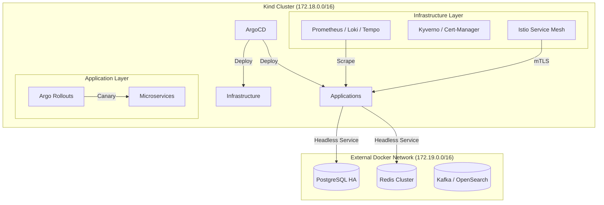

# 🌌 hy-home.k8s

[](https://opensource.org/licenses/MIT)
[](https://kubernetes.io/)
[](https://argoproj.github.io/cd/)
[](https://istio.io/)

**GitOps-based Kubernetes Infrastructure Platform** designed for local development and high-fidelity testing. This project leverages **ArgoCD** for declarative deployment of platform services and applications on **Kind** (Kubernetes in Docker).

> 📚 **Documentation**: For full guides and references, please visit the [docs/](docs/) directory.

---

## 🏗️ Architecture Overview

The platform uses a "Hybrid Cloud" model for local development: core orchestration runs inside **Kind**, while resource-heavy stateful services run in dedicated **Docker** networks.



---

## 🛠️ Technical Stack

| Category | Component | Version | Description |
|----------|-----------|---------|-------------|
| **Runtime** | Kind (K8s) | v1.31.0 | Kubernetes in Docker for local development |
| **GitOps** | ArgoCD | v2.13.0 | Declarative CD and App-of-Apps management |
| **Net / Mesh** | Istio | v1.24.0 | Service Mesh with STRICT mTLS encryption |
| **LB** | MetalLB | v0.14.9 | L2 Load Balancer for local Service IPs |
| **Observability** | Prometheus | v2.51.0 | Metrics collection via kube-prometheus-stack |
| **Observability** | Loki / Tempo | v3.0 / v2.6 | Distributed logging and tracing (OTLP) |
| **Observability** | Alloy | v0.9.0 | Unified telemetry collector |
| **Security** | Kyverno | v1.12.0 | Policy engine for security best practices |
| **Secrets** | Sealed Secrets | v0.27.0 | Encrypted GitOps secrets via Bitnami |
| **Workflow** | Airflow | v2.9.0 | Workflow orchestration and data pipelines |

---

## 🚀 Quick Start (15 Minutes)

### 1. Prerequisites

- Docker Desktop or Docker Engine
- `kubectl`, `kind`, `helm`
- `kubeseal` (for secrets management)

### 2. Bootstrap the Cluster

```bash
# Clone the repository
git clone https://github.com/buenhyden/hy-home.k8s.git
cd hy-home.k8s

# Execute bootstrap sequence
./bootstrap/cluster-setup.sh
./bootstrap/argocd-install.sh
./bootstrap/root-apps.sh
```

### 3. Access ArgoCD

The bootstrap process outputs the credentials. To retrieve them manually:

```bash
# Get Admin Password
kubectl -n argocd get secret argocd-initial-admin-secret -o jsonpath="{.data.password}" | base64 -d

# Port-forward to UI
kubectl port-forward svc/argocd-server -n argocd 8080:443
# Open https://localhost:8080 (User: admin)
```

---

## 💎 Core Features

### 🔄 Progressive Delivery (Canary)

We use **Argo Rollouts** for all application deployments. The default template supports:

- **Canary Strategy**: 20% traffic split -> Analysis -> 100% promotion.
- **Istio Integration**: Fine-grained traffic weighting via VirtualServices.

### 🛡️ Security First

- **mTLS Everywhere**: All service-to-service communication is encrypted by default.
- **Kyverno Policies**: Automated blocking of `:latest` tags and non-root containers.
- **Sealed Secrets**: All secrets in Git are encrypted; only the cluster can decrypt them.

### 🌉 Hybrid Networking

Bridge the gap between K8s and Docker with our pre-configured network bridge:

- Kind Nodes (172.18.x) can reach Docker Services (172.19.x) via direct routing.
- Use `infrastructure/external-services` for headless database connectors.

---

## 📂 Project Structure

A detailed break-down of the top-level directories:

- **`apps/`**: ArgoCD Application manifests and user workloads.
  - `_templates/`: Helm starter templates.
  - `_examples/`: Reference implementations.
- **`infrastructure/`**: Core platform services managed by Helm.
  - `observability/`: LGTM stack (Loki, Grafana, Tempo, Mimir).
  - `security/`: Kyverno, Sealed Secrets, Cert-Manager.
  - `controllers/`: Ingress, Gateway API, various operators.
- **`bootstrap/`**: Scripts for initial cluster setup (`cluster-setup.sh`).
- **`clusters/`**: Environment overlays (e.g., `primary-cluster` configuration).
- **`docs/`**: Project documentation, architecture guides, and reference material.
- **`.agent/workflows/`**: Operational workflows for AI agents.

---

## 🤖 AI & Automation

This project is built with an **"AI-Native"** mindset, utilizing specialized agents for development and maintenance.

- **Agent Rules**:
  - [AGENTS.md](AGENTS.md): General agent roles and responsibilities.
  - [CLAUDE.md](CLAUDE.md): Specific instructions for Claude.
  - [GEMINI.md](GEMINI.md): Specific instructions for Gemini (Antigravity).
  - [.cursorrules](.cursorrules): Context rules for Cursor AI.
- **Workflows**: Standard procedures are defined in `.agent/workflows/` and should be prioritized for complex tasks.

---

## 📜 License

This project is licensed under the **MIT License**. See the [LICENSE](LICENSE) file for details.

---
© 2026 [buenhyden](https://github.com/buenhyden) | **hy-home.k8s**
