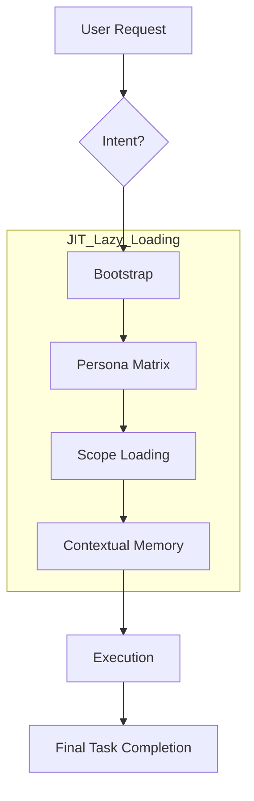

# Project Agent Instructions

Shared entrypoint for all AI agents. Enforces a **Lazy Loading Protocol**.

## 1. Lazy Loading Protocol (JIT)

1. **Intent Identification**: Determine task nature.
2. **Bootstrap**: Load [bootstrap.md](rules/bootstrap.md).
3. **Trigger Rules**: Select persona from [persona-matrix.md](rules/persona-matrix.md).
4. **Load Scope**: Load layer-specific rules from [scopes/](scopes/).
5. **Context Check**: Check [memory/](memory/) for lessons.
6. **Execute**: Use tools & [commands.md](commands.md).

## 2. Intent-to-Scope Mapping

| Intent | Persona | Load Scope | Primary SSoT |
| :--- | :--- | :--- | :--- |
| Requirements | PM | `product.md` | `docs/01.prd/` |
| Architecture | Architect | `architecture.md` | `docs/02.ard/`, `docs/03.adr/` |
| Specifications | Engineer | `docs.md` | `docs/04.specs/` |
| Backend | Backend Dev | `backend.md` | `docs/04.specs/` |
| Frontend | Frontend Dev | `frontend.md` | `docs/04.specs/` |
| Infrastructure | DevOps | `infra.md` | `docs/08.operations/` |
| Security | Security | `security.md` | `docs/04.specs/`, `docs/10.incidents/` |
| QA / Testing | QA | `qa.md` | `docs/05.plans/`, `docs/06.tasks/` |
| Guides | Writer | `docs.md` | `docs/07.guides/` |
| Operations | Ops | `infra.md` | `docs/09.runbooks/` |
| Postmortems | Analyst | `docs.md` | `docs/11.postmortems/` |
| References | Researcher | `docs.md` | `docs/90.references/` |
| Templates | Engineer | `docs.md` | `docs/99.templates/` |

## 3. Creative Mandate

Agents are explicitly authorized to populate `scripts/` and `tests/` directories.

- **Purpose**: Automate repetitive tasks and ensure regression safety.
- **Rules**:
  - Follow the **Idempotency** standard in `scripts/README.md`.
  - Co-locate unit tests, but use `tests/` for global suites.
  - Never hardcode environmental secrets.

## 4. Core Directives

- **English Mandatory**: All internal instructions in `docs/00.agent-governance/` MUST be in English.
- [commands.md](commands.md): Precise command inventory.
- **Human-Facing**: READMEs and overviews MUST be in Korean.
- **Spec-Driven**: Changes require approved artifacts in `docs/01.prd/` and `docs/04.specs/`.
- **Response Mandate**: Always respond to user requests in **Korean (한국어)**.

---
*Ref: [AGENTS.md](../../AGENTS.md), [persona-matrix.md](rules/persona-matrix.md), [bootstrap.md)(rules/bootstrap.md)*
*Bootstrap First**: Always load `docs/00.agent-governance/rules/bootstrap.md` initially to establish context.

---
*Ref: [AGENTS.md](../../AGENTS.md)*
