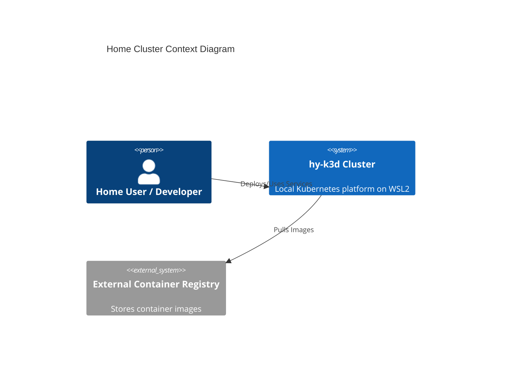
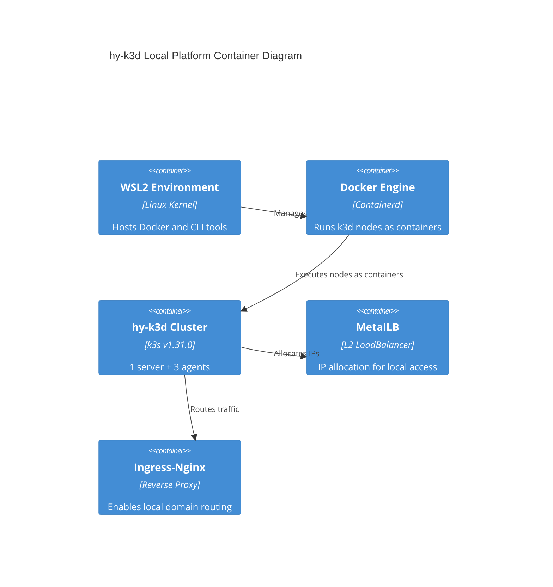

# Home Cluster Architecture Reference Document (ARD)

## Overview (KR)
이 문서는 WSL2 환경에서 k3d를 이용한 로컬 Kubernetes 클러스터(`hy-k3d`)의 아키텍처 표준을 정의합니다. 하드웨어/소프트웨어 요구사항, 시스템 경계, 그리고 GPU 가속 워크로드를 포함한 인프라 결정 사항을 포함합니다.

---

## 1. Metadata & Status

- **Status**: Approved
- **Owner**: buenhyden
- **Scope**: master
- **layer:** infra
- **PRD Reference**: [2026-02-27-home-cluster-infra-prd.md](../prd/2026-02-27-home-cluster-infra-prd.md)
- **ADR References**: [0001-k3d-local-cluster.md](../adr/0001-k3d-local-cluster.md)

## 2. System Boundaries & Ownership

- **Owns**: Cluster lifecycle (k3d), base networking (MetalLB), Ingress controller (Nginx), Local storage provisioning.
- **Consumes**: Windows Host Resources (WSL2), Docker Engine, External Container Registries.
- **Does Not Own**: Application workloads, CI/CD runners (unless hosted within), External DNS.

## 3. Architecture Context (C4 Model)

### 3.1 Level 1: System Context

### 3.2 Level 2: Containers

## 4. Technical Stack & Integrity

- **Orchestration**: Kubernetes v1.31.0 (k3s distribution via k3d)
- **Engine**: k3d (k3s in Docker)
- **Host Platform**: Windows Subsystem for Linux (WSL2)
- **Load Balancer**: MetalLB (L2 Mode)
- **Ingress**: ingress-nginx (baseline)
- **Cross-Cutting Concerns**: 
  - **Auth**: Native K8s RBAC + kubeconfig
  - **Logging**: `kubectl logs` / `docker logs` (baseline)
  - **Storage**: `local-path` StorageClass (WSL2-backed)

## 5. FinOps & Sustainability (Senior)

### 5.1 Cost Architecture (FinOps)

- **Cost Driver**: Host RAM and GPU VRAM.
- **Monthly Estimate**: $0 (Local hardware-based).
- **Optimization Strategy**: Use of lightweight `k3s` distribution to minimize overhead. Aggressive resource limits for non-critical pods.

### 5.2 Sustainability (Greedy-Green)

- **Resource Footprint**: Medium (depends on active agent nodes).
- **Carbon Intensity**: Optimized by running on low-power local hardware (NUC/Home Server) when idle.

## 6. Resilience & Scalability (Senior)

### 6.1 Failure Modes & Mitigation

| Scenario | Impact | Mitigation Strategy |
| :--- | :--- | :--- |
| **WSL2 Restart** | Cluster offline | Automated k3d start-up script on WSL boot. |
| **Agent Node Crash** | Pod reallocation failed | Multi-node setup (3 agents) ensures high availability within local context. |
| **Disk Pressure** | Container eviction | Automated node cleanup using `docker system prune` hooks. |

### 6.2 Scaling Triggers

- **Horizontal Scale (Agents)**: Manual k3d command to join agents if resource utilization exceeds 80%.
- **Vertical Scale**: Update `.wslconfig` to increase JVM/System memory allocation.

## 7. Data Architecture & Persistence

- **Domain Entities**: PVCs, StorageClasses, PersistentVolumes.
- **Consistency Model**: Local persistence (Node-local).
- **Data Retention**: Persistent until manual deletion or cluster recreation (unless host path is preserved).

## 8. Operational Roadmap

- **Deployment**: Declarative templates via `infrastructure/k3d/`.
- **Observability**: Prometheus/Grafana (Milestone 2).
- **Runbook**: [2026-03-16-infra-spec.md](../specs/2026-03-16-infra-spec.md)
