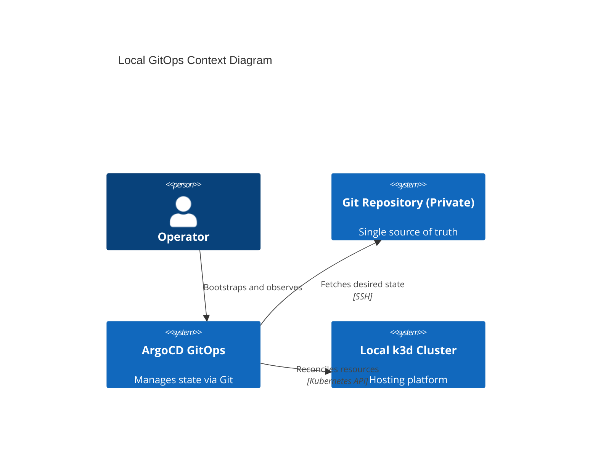
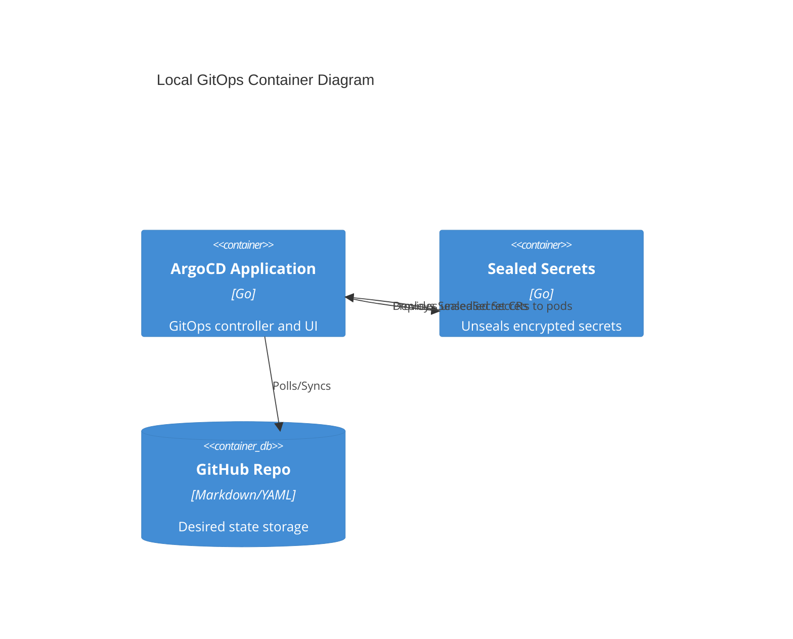

# ArgoCD GitOps Architecture Reference Document (ARD)

## Overview (KR)
이 문서는 로컬 k3d 클러스터의 선언적 관리(GitOps)를 위한 ArgoCD 및 Sealed Secrets 아키텍처 표준을 정의합니다. 아키텍처 토폴로지(App-of-Apps), 보안 전략, 그리고 복구 모델을 포함합니다.

---

## 1. Metadata & Status

- **Status**: Approved
- **Owner**: buenhyden
- **Scope**: master
- **layer:** gitops
- **PRD Reference**: [2026-03-07-argocd-gitops-prd.md](../prd/2026-03-07-argocd-gitops-prd.md)
- **ADR References**: [0002-argocd-gitops.md](../adr/0002-argocd-gitops.md)

## 2. System Boundaries & Ownership

- **Owns**: GitOps reconciliation logic, App-of-Apps topology, Secret sealing/unsealing (Sealed Secrets), Repository credentials.
- **Consumes**: GitHub Private Repositories (Desired State), Kubernetes API (Live State), SSH Deploy Keys.
- **Does Not Own**: Infrastructure provisioning (k3d), External container images (OCI), Workload-specific application logic.

## 3. Architecture Context (C4 Model)

### 3.1 Level 1: System Context

### 3.2 Level 2: Containers

## 4. Technical Stack & Integrity

- **GitOps Engine**: ArgoCD v3.3.0 (App-of-Apps pattern)
- **Secret Management**: Bitnami Sealed Secrets v0.33.1
- **Manifest Format**: Kustomize
- **Cross-Cutting Concerns**: 
  - **Auth**: Local admin login (V1), Deploy keys (SSH)
  - **Logging**: Git history (Audit trail), Controller logs
  - **Integrity**: Webhook-based sync (Deferred), Manual/Auto sync policies

## 5. FinOps & Sustainability (Senior)

### 5.1 Cost Architecture (FinOps)

- **Cost Driver**: Controller CPU/RAM usage.
- **Monthly Estimate**: $0 (Local).
- **Optimization Strategy**: Aggressive sync frequency tuning to minimize unnecessary Git API calls.

### 5.2 Sustainability (Greedy-Green)

- **Resource Footprint**: Low.
- **Carbon Intensity**: Minimized by running only when local cluster is active.

## 6. Resilience & Scalability (Senior)

### 6.1 Failure Modes & Mitigation

| Scenario | Impact | Mitigation Strategy |
| :--- | :--- | :--- |
| **Git Unreachable** | Sync blocked | Cache last-known-good manifests in controller. |
| **SealedKey Lost** | Secrets unusable | Disaster recovery of master key via offline backup (Sealed Secrets master key). |
| **ArgoCD Crash** | Drift unmanaged | Self-healing via Deployment replicas; manual recovery via `kubectl apply -k bootstrap/`. |

### 6.2 Scaling Triggers

- **Horizontal Scale**: ApplicationSet usage for multi-cluster/multi-tenant expansion.
- **Vertical Scale**: Increase resource requests for `argocd-repo-server` if manifest generation latency > 30s.

## 7. Data Architecture & Persistence

- **Domain Model**: Application, AppProject, SealedSecret CRDs.
- **Consistency Model**: Eventual Consistency (Sync Loop).
- **Data Retention**: Git commit history (Permanent audit trail).

## 8. Operational Roadmap

- **Deployment**: `infrastructure/bootstrap/` manual apply for first-run.
- **Observability**: ArgoCD UI + Prometheus metrics.
- **Runbook**: [2026-03-16-gitops-spec.md](../specs/2026-03-16-gitops-spec.md)
