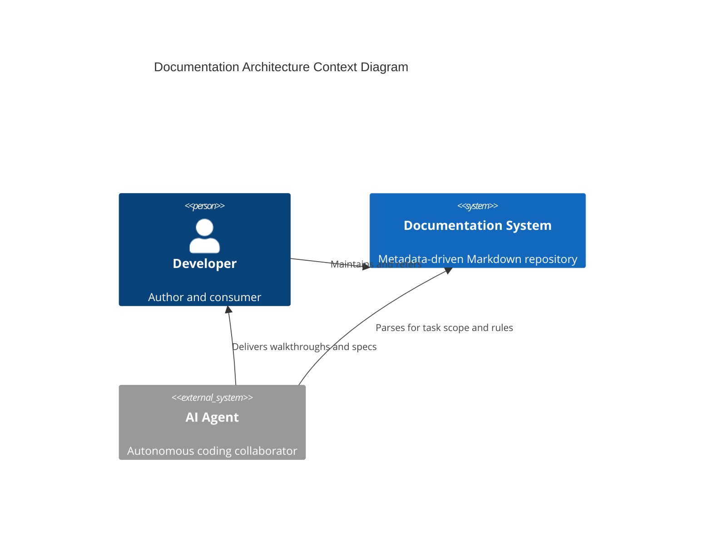
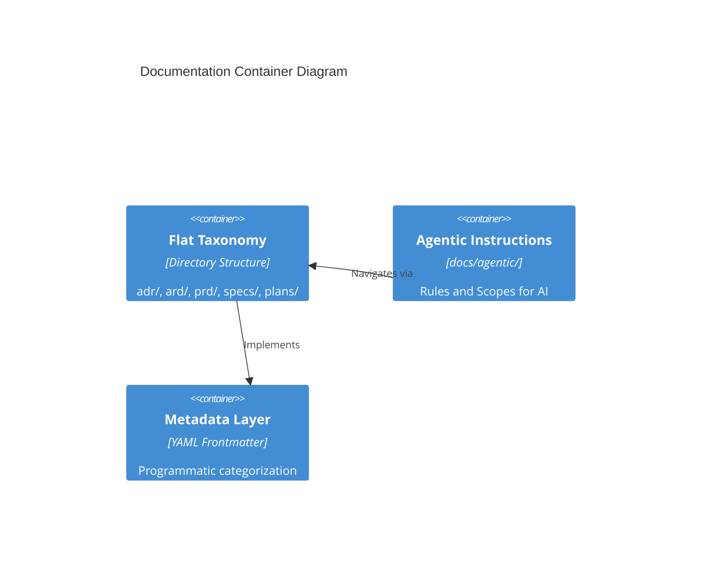

# Documentation Architecture Reference Document (ARD)

## Overview (KR)
이 문서는 `hy-home.k8s` 저장소의 지식 관리 및 AI 협업 체계를 위한 문서 아키텍처 표준을 정의합니다. 모든 문서는 계층화된 메타데이터를 포함하며, AI 에이전트가 최소한의 컨텍스트로 작업을 수행할 수 있도록 최적화된 평탄화된 디렉토리 구조를 따릅니다.

---

## 1. Metadata & Status

- **Status**: Approved
- **Owner**: buenhyden
- **Scope**: master
- **layer:** meta
- **PRD Reference**: [2026-03-15-documentation-refactor-prd.md](../prd/2026-03-15-documentation-refactor-prd.md)
- **ADR References**: [0003-documentation-taxonomy-standard.md](../adr/0003-documentation-taxonomy-standard.md), [0004-documentation-refactor-decision.md](../adr/0004-documentation-refactor-decision.md)

## 2. System Boundaries & Ownership

- **Owns**: `docs/` root taxonomy, `docs/agentic/` instruction dispatching, Metadata standards, Template governance.
- **Consumes**: Markdown standards, AI Agent system prompts (Claude/Gemini).
- **Does Not Own**: Actual code implementations (specs only), Infrastructure configs (yaml), Third-party library documentation.

## 3. Architecture Context (C4 Model)

### 3.1 Level 1: System Context

### 3.2 Level 2: Containers

## 4. Technical Stack & Integrity

- **Markup Language**: Markdown (GFM)
- **Metadata Standard**: YAML Frontmatter (Mandatory `layer` attribute)
- **Validation**: `markdownlint` + custom regex checks
- **Cross-Cutting Concerns**: 
  - **Localization**: Bilingual Overview (KR) headers
  - **Naming**: Plural paths for execution docs (`specs/`, `plans/`)
  - **Linking**: Absolute internal paths for robust agent navigation

## 5. FinOps & Sustainability (Senior)

### 5.1 Cost Architecture (FinOps)

- **Cost Driver**: AI Token consumption (In-context learning).
- **Monthly Estimate**: Optimized to minimize redundant context loading.
- **Optimization Strategy**: Lazy loading of documentation based on `layer` filtering.

### 5.2 Sustainability (Greedy-Green)

- **Resource Footprint**: Negligible (Static files).
- **Carbon Intensity**: N/A.

## 6. Resilience & Scalability (Senior)

### 6.1 Failure Modes & Mitigation

| Scenario | Impact | Mitigation Strategy |
| :--- | :--- | :--- |
| **Metadata Missing** | Agent loses context | Linting gate (pre-commit) to enforce frontmatter. |
| **Path Drift** | Broken links | Automated link validation in CI. |
| **Context Bloat** | High token cost | Implementation of modular "Lazy Loading" (ADR 0000). |

### 6.2 Scaling Triggers

- **Horizontal Scale**: Adoption of "Domain-based" subdirectories if root `docs/` exceeds 100+ files.
- **Vertical Scale**: Use of LLM-native vector indexing (RAG) if manual parsing becomes inefficient.

## 7. Data Architecture & Persistence

- **Domain Entities**: ADR, ARD, PRD, Spec, Plan, Runbook.
- **Consistency Model**: Single Source of Truth (SSOT) per feature.
- **Data Retention**: Versioned via Git (Permanent).

## 8. Operational Roadmap

- **Deployment**: Automatic sync to Agent Context.
- **Observability**: AI Accuracy metrics / User feedback on doc quality.
- **Runbook**: [documentation-management.md](../runbooks/documentation-management.md)
