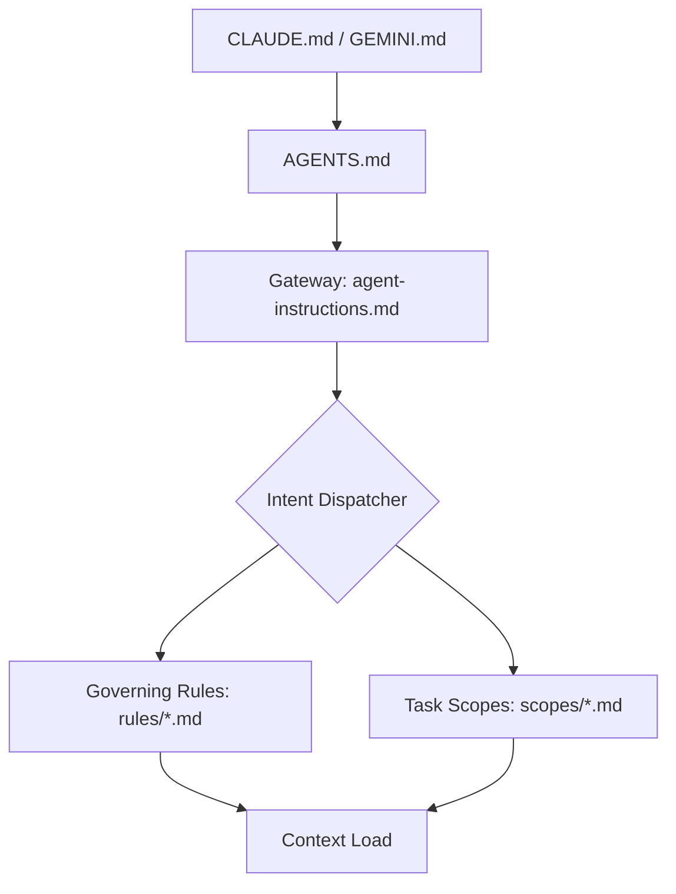

# Agent Instruction System Architecture

- **Status**: Approved
- **Owner**: buenhyden
- **Scope**: master
- **layer:** architecture

**Overview (KR):** AI 에이전트가 리포지토리를 자율적으로 탐색하고 지침을 단계적으로 로드하기 위한 명세 및 아키텍처 구조를 정의합니다. 이를 통해 에이전트의 컨텍스트 관리를 최적화하고 일관된 동작을 보장합니다.

## 1. Problem Statement
@[/doc-coauthoring] (KR): AI 에이전트가 리포지토리를 자율적으로 탐색하고 지침을 단계적으로 로드하기 위한 명세 및 아키텍처 구조를 정의합니다.

## Summary

The Agent Instruction System is the primary governance layer for Human-AI collaboration in the `hy-home.k8s` repository. It is designed to be high-performance (low token overhead) and strictly spec-compliant.

## Boundaries

- **Owns**: Instruction dispatching logic, rule set organization, and intent-to-scope mapping.
- **Consumes**: Markdown files in `docs/agentic/`, user intent signals.
- **Does Not Own**: Actual code implementation logic beyond document structure rules.

## Ownership

- **Primary owner**: buenhyden
- **Primary artifacts**: `docs/agentic/`, `AGENTS.md`
- **Operational evidence**: `[../runbooks/documentation-management.md]`

## 1. Overview

The Agent Instruction System is the primary governance layer for Human-AI collaboration in the `hy-home.k8s` repository. It is designed to be high-performance (low token overhead) and strictly spec-compliant.

## 2. Component Diagram (Mermaid)

## 3. Communication Patterns

### Lazy Loading Protocol

1. **Discovery**: Entry points (`AGENTS.md`) provide a minimal context.
2. **Intent Recognition**: The agent identifies the task type (e.g., "Create a spec").
3. **Scoped Injection**: The agent reads only the files listed in the **Intent-to-Scope Mapping** within `agent-instructions.md`.

### Metadata standards

- Every agent-generated file MUST contain a `layer` attribute in YAML frontmatter.
- Valid Layers: `meta`, `infra`, `gitops`, `app`, `ops`.

## 4. Constraint Matrix

| Constraint | Enforcement |
| --- | --- |
| **Max Token Load** | 15k Tokens (estimated) |
| **Instruction Location** | `docs/agentic/` |
| **Template Location** | `templates/` |
| **Persistence** | Plural directory paths only (`plans/`, `specs/`) |

## 5. Directory Organization

- `docs/agentic/rules/`: Persona-level behavioral rules.
- `docs/agentic/scopes/`: Task-level technical instructions and target paths.
