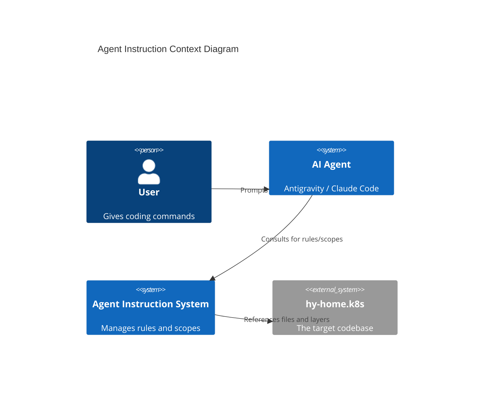
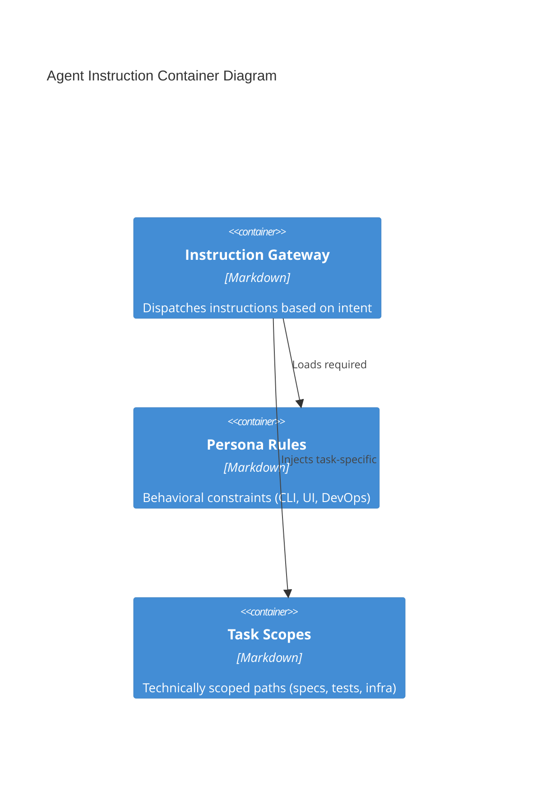

# Agent Instruction System Architecture (ARD)

## Overview (KR)
이 문서는 AI 에이전트가 리포지토리를 자율적으로 탐색하고 지침을 단계적으로 로드(Lazy Loading)하기 위한 에이전트 지시 시스템 아키텍처를 정의합니다. 지능형 의도 분석, 동적 스코프 로드, 그리고 페르소나별 규칙 세트를 포함합니다.

---

## 1. Metadata & Status

- **Status**: Approved
- **Owner**: buenhyden
- **Scope**: master
- **layer:** architecture
- **PRD Reference**: [2026-03-15-documentation-refactor-prd.md](../prd/2026-03-15-documentation-refactor-prd.md)
- **ADR References**: [0000-lazy-loading-implementation.md](../adr/0000-lazy-loading-implementation.md)

## 2. System Boundaries & Ownership

- **Owns**: `docs/agentic/` directory, Gateway dispatching (`agent-instructions.md`), Task scope mappings, Persona rules.
- **Consumes**: User messages (Intent), File system (Context), Metadata frontmatter.
- **Does Not Own**: Model-specific system prompts (internal to Antigravity/Claude), Code execution engine.

## 3. Architecture Context (C4 Model)

### 3.1 Level 1: System Context

### 3.2 Level 2: Containers

## 4. Technical Stack & Integrity

- **Dispatch Model**: Lazy Loading (Intent-based)
- **Persistence Layer**: Markdown-based persistent memory
- **Registry**: `agent-instructions.md` as the central hub
- **Cross-Cutting Concerns**: 
  - **Security**: Skill invocation required before any response
  - **Compliance**: Metadata frontmatter enforcement
  - **Performance**: Goal of <15k tokens per context load

## 5. FinOps & Sustainability (Senior)

### 5.1 Cost Architecture (FinOps)

- **Cost Driver**: Input token count (System prompts + Documentation overhead).
- **Monthly Estimate**: Optimized via modularity ($0.50 - $1.00 per agent task).
- **Optimization Strategy**: Sequential Loading of instructions only when necessary for the current task scope.

### 5.2 Sustainability (Greedy-Green)

- **Resource Footprint**: Minimal (Logic overhead).
- **Carbon Intensity**: N/A (Cloud-based LLM computation).

## 6. Resilience & Scalability (Senior)

### 6.1 Failure Modes & Mitigation

| Scenario | Impact | Mitigation Strategy |
| :--- | :--- | :--- |
| **Wrong Intent Detected** | Suboptimal context load | Human-in-the-loop verification (notify_user). |
| **Monolithic Rule Growth** | Token bloat | Skill `agent-md-refactor` to split bloated files. |
| **Conflicting Rules** | Hallucination/Stall | Hierarchy of rules: Global Rules > Scoped Rules. |

### 6.2 Scaling Triggers

- **Horizontal Scale**: Creation of sub-agent personas (Frontend-specialist, K8s-specialist).
- **Vertical Scale**: Transition to JSON/Schema-locked instructions if Markdown parsing ambiguity increases.

## 7. Data Architecture & Persistence

- **Domain Entities**: Rule, Scope, Intent, Tool.
- **Consistency Model**: Sticky Context (per conversation thread).
- **Data Retention**: Conversation logs as short-term memory; KIs as long-term memory.

## 8. Operational Roadmap

- **Deployment**: `AGENTS.md` shim deployment.
- **Observability**: Token usage tracking per task.
- **Runbook**: [agentic-workflows-runbook.md](../runbooks/agentic-workflows-runbook.md)
