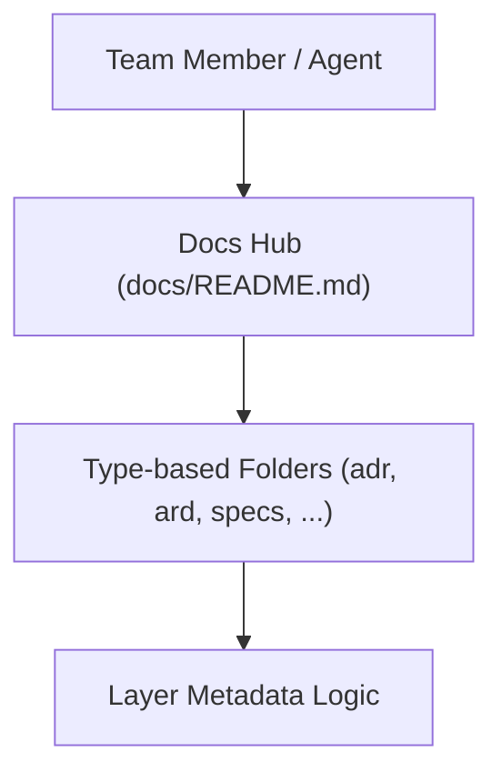

# Architecture Reference Document: Documentation System

- **Status**: Approved
- **layer:** meta

**Overview (KR):** 리포지토리의 문서 자동화 및 탐색 최적화를 위한 flattened taxonomy 시스템 구조를 설명합니다.

## 1. System Overview

The documentation system is a flattened, type-based taxonomy designed for high discoverability and optimized AI agent context management.

## 2. Directory Structure

All documents are organized by type at the root `docs/` level:

- `adr/`: Architecture Decision Records
- `ard/`: Architecture Reference Documents
- `prd/`: Product Requirements Documents
- `specs/`: Technical Specifications
- `plans/`: Phased Execution Plans
- `runbooks/`: Operational Procedures
- `manuals/`: System manuals, Collaboration, and Governance
- `incidents/`: Incident Reports
- `postmortems/`: System Postmortems

## 3. High-Level Design (C4 Context)

## 4. Resilience & Failure Modes

### Failure Scenarios

| Failure Mode | Impact | Mitigation Strategy |
| :--- | :--- | :--- |
| **Recursive Linking** | Agent loop / Token bloat | Use relative paths; restrict link depth |
| **Metadata Drift** | Automated filtering fails | CI gate to validate `layer:` field |
| **Taxonomy Overlap** | Confusion on where to place docs | Clear definitions in `manuals/README.md` |

## 5. Scaling Triggers

- **Trigger 1**: Subdirectory count in `docs/` > 20 -> Re-evaluate hierarchy.
- **Trigger 2**: Individual file size > 500 lines -> Enforce **Index Pattern**.

## 3. Mandatory Metadata

Every markdown file MUST include YAML frontmatter with a `layer` key identifying its domain (e.g., `infra`, `gitops`, `app`, `ops`, `meta`).

## Related Documents

- [2026-03-16-documentation-system-prd.md](../prd/2026-03-16-documentation-system-prd.md)
- [2026-03-16-documentation-system-spec.md](../specs/2026-03-16-documentation-system-spec.md)
