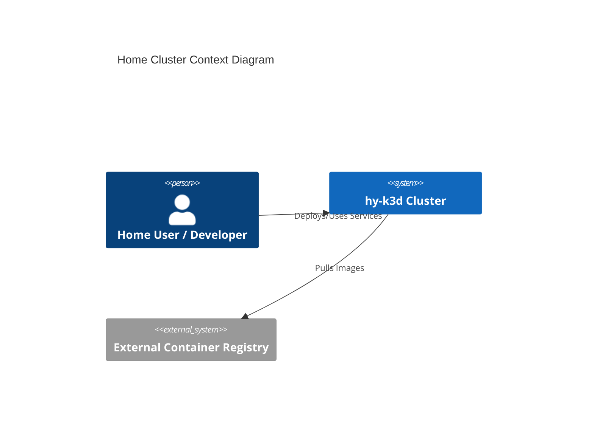

# Home Cluster Architecture Reference Document (ARD)

*Target Directory: `docs/ard/core-infra/k3d-cluster-requirements.md`*

- **Status**: Approved
- **Owner**: hy
- **PRD Reference**: [Link to PRD](../../../docs/prd/core-infra/home-cluster-infra-prd.md)
- **ADR References**: [Link to ADRs](../../../docs/adr/core-infra/0001-k3d-local-cluster.md)

---

## 1. Executive Summary

This document defines the high-level architecture for the local Kubernetes environment (hy-k3d). It outlines the core components, technology stack, and non-functional requirements necessary to support home automation and development services with GPU acceleration.

## 2. Business Goals

- Provide a stable and reproducible k8s environment.
- Enable local testing of AI and home automation services.
- Minimize host resource impact while maximizing workload efficiency.

## 3. System Overview & Context

The `hy-k3d` cluster acts as the central execution engine for all localized services.

## 4. Architecture & Tech Stack Decisions (Checklist)

### 4.1 Component Architecture

The cluster follows a standard multi-node setup using Docker containers as nodes.

- **Server Node**: 1 Control Plane node (Master).
- **Agent Nodes**: 3 Worker nodes for workload isolation and redundancy.

### 4.2 Technology Stack

- **Orchestration**: Kubernetes v1.31.0 (k3s distribution).
- **Engine**: k3d (k3s in Docker).
- **Host Platform**: Windows Subsystem for Linux (WSL2).
- **Runtime**: NVIDIA Container Runtime (for GPU support).
- **Ingress Layer**: Custom (Traefik disabled in base config).

## 5. Data Architecture

- **Storage Strategy**: Local volume mounts for persistent data.
- **WSL Path Mapping**: Ensure data mounts stay within the WSL filesystem (`/home/...`) rather than Windows paths (`/mnt/c/...`) for optimal performance.
- **Persistence**: Managed through PVCs targeting local-path provisioner.

## 6. Security & Compliance

- **Authentication**: Native k8s Auth via kubeconfig.
- **Network Isolation**: Enabled by default within Docker network.
- **TLS**: SAN configured for 127.0.0.1 for local secure access.

## 7. Infrastructure & Deployment

- **Deployment Hub**: Local Host (Commodity Hardware).
- **Orchestration**: k3d.
- **Manifests**: Located in `infrastructure/k3d/`.

## 8. Non-Functional Requirements (NFRs)

- **Availability**: 99% (local hardware dependent).
- **Performance (Latency)**: Latency to kube-api < 5ms (local).
- **Throughput**: Capable of handling 50+ concurrent microservices.
- **Resource Constraints**: Subject to `.wslconfig` limits (suggested 8GB RAM minimum).
- **GPU Request**: `all` (GPU capabilities exposed to all containers).

## 9. Architectural Principles, Constraints & Trade-offs

- **What NOT to do**: Manual configuration via `kubectl edit` is discouraged; use manifests.
- **Constraints**:
  - Limited by host RAM and GPU VRAM.
  - WSL2 requires `systemd=true` in `/etc/wsl.conf` for service consistency.
- **Considered Alternatives**: Kind, Minikube.
- **Chosen Path Rationale**: k3d offers superior performance and easy GPU integration.
