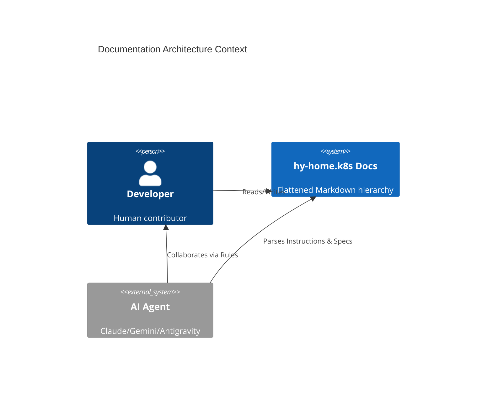

# Documentation Architecture Reference Document

- **Status**: Approved
- **Owner**: buenhyden
- **Scope**: master
- **layer:** meta
- **PRD Reference**: `[../prd/documentation-refactor-prd.md]`
- **ADR References**: `[../adr/0001-documentation-refactor-decision.md]`

**Overview (KR):** 저장소의 지식 관리 및 AI 협업 체계를 위한 문서 아키텍처를 정의합니다. 모든 문서는 계층화된 메타데이터를 포함하며 평탄화된 디렉토리 구조를 따릅니다.

## Summary

This ARD defines the structural standards for documentation and AI instructions within `hy-home.k8s`. It establishes a flat, type-first hierarchy optimized for both human readability and machine (AI agent) parsing.

## Boundaries

- **Owns**: Root documentation layout, `docs/` subtree structure, `docs/agentic/` instruction model.
- **Consumes**: Pre-existing markdown files, template standards.
- **Does Not Own**: Implementation code, GitOps manifests, third-party library docs.

## Ownership

- **Primary owner**: buenhyden
- **Primary artifacts**: `docs/`, `AGENTS.md`, `CLAUDE.md`, `GEMINI.md`
- **Operational evidence**: `[../operations/postmortems/]`

## 1. Executive Summary

The documentation architecture transitions from a deeply nested guide-based structure to a flattened, metadata-driven model. This enables agents to selectively load context based on active task rules.

## 2. Business Goals

- Improve AI Agent context efficiency.
- Standardize contribution gates via spec-driven work.
- Decouple high-level policy from low-level runbooks.

## 3. System Overview & Context

## 4. Source-of-Truth Map

| Scope   | Canonical Document                            | Role                             |
| ------- | --------------------------------------------- | -------------------------------- |
| master  | `ARCHITECTURE.md`                             | Root architectural law           |
| domain  | `docs/ard/<domain>-ard.md`                    | Domain-specific design           |
| feature | `docs/specs/<feature>-spec.md`                | Implementation source of truth   |
