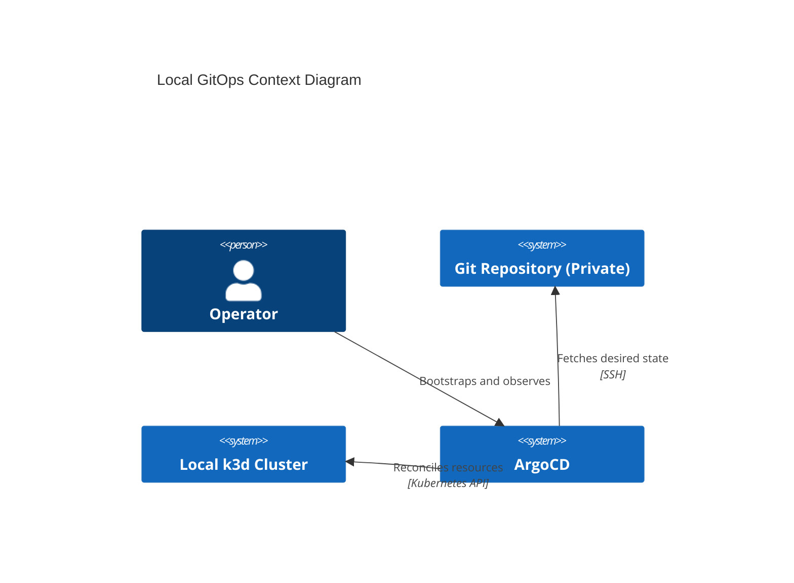
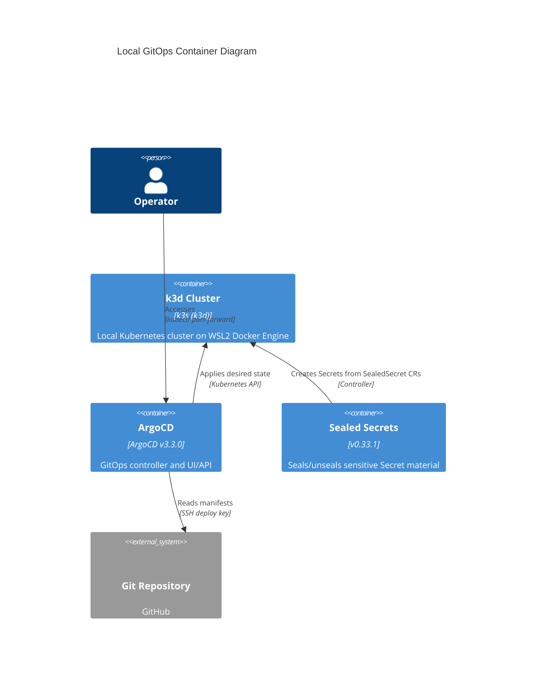

# ArgoCD GitOps Architecture Reference Document (ARD)

*Target Directory: `docs/ard/gitops/argocd-gitops-architecture.md`*

- **Status**: Draft
- **Owner**: hy
- **PRD Reference**: [docs/prd/gitops/argocd-gitops-prd.md](../../prd/gitops/argocd-gitops-prd.md)
- **ADR References**: [docs/adr/gitops/0001-argocd-gitops.md](../../adr/gitops/0001-argocd-gitops.md)

---

## 1. Executive Summary

This document describes the architecture for GitOps management of the local WSL2 + k3d Kubernetes cluster using ArgoCD and Sealed Secrets. It focuses on deterministic installation, secure private repository access, and the App-of-Apps topology.

## 2. Business Goals

- Provide repeatable local cluster convergence from Git.
- Reduce operational risk of manual apply and unmanaged drift.
- Standardize secure handling of repository credentials for private Git sources.

## 3. System Overview & Context

## 4. Architecture & Tech Stack Decisions (Checklist)

### 4.1 Component Architecture

### 4.2 Technology Stack

- **Orchestration**: Kubernetes on k3d (k3s distribution)
- **GitOps**: ArgoCD (App-of-Apps)
- **Secret Handling**: Bitnami Sealed Secrets + SSH deploy key
- **Manifests**: Kustomize directory structure (no Helm requirement in v1)

## 5. Data Architecture

- **Domain Model**: N/A (Infrastructure control plane)
- **Storage Strategy**: Git repository as system-of-record; Kubernetes API as applied state
- **Data Flow**: ArgoCD reads from Git, compares to cluster live state, applies deltas; SealedSecrets unseals sealed payloads into Secrets.

## 6. Security & Compliance

- **Authentication/Authorization**: Local single-operator ArgoCD admin login (v1). Multi-user SSO/RBAC is a follow-up.
- **Data Protection**:
  - No plaintext Secret committed.
  - SSH deploy key is read-only.
  - SealedSecrets encryption keys remain inside the cluster; rotation is a follow-up.
- **Audit Logging**: Git history is the primary audit log for desired state changes.

## 7. Infrastructure & Deployment

- **Deployment Hub**: Local WSL2 + Docker Engine (WSL-managed) + k3d
- **Orchestration**: k3d cluster on Docker bridge network
- **CI/CD Pipeline**: Out of scope for v1 (local GitOps bootstrap only)

## 8. Non-Functional Requirements (NFRs)

- **Availability**: Best-effort local environment (no SLA); must self-heal drift on operator mistakes.
- **Performance (Latency)**: GitOps reconciliation should converge within 5 minutes per sync on typical hardware.
- **Throughput**: Not applicable (control plane only).
- **Scalability Strategy**: App-of-Apps allows future expansion to ApplicationSet / multi-cluster if required.

## 9. Architectural Principles, Constraints & Trade-offs

- **What NOT to do**:
  - No plaintext Secrets in Git.
  - No “latest” tags for controllers or images.
  - No exposing ArgoCD via Ingress/NodePort in v1 baseline.
- **Constraints**:
  - Bootstrap requires manual steps because ArgoCD cannot read a private repo without credentials.
  - `targetRevision` pinning trades convenience for reproducibility.
- **Considered Alternatives**: Flux, ArgoCD without sealed secrets, public repo.
- **Chosen Path Rationale**: ArgoCD UI + reconciliation semantics + SealedSecrets fit local v1 constraints.
- **Known Limitations**: Secret rotation, multi-user RBAC/SSO, and multi-environment promotions are deferred.

---

> [!TIP]
> This ARD avoids code-level detail. The exact bootstrap procedure and file paths live in the GitOps Spec and runbooks.
