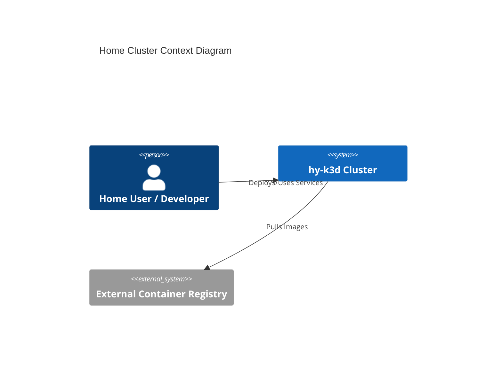
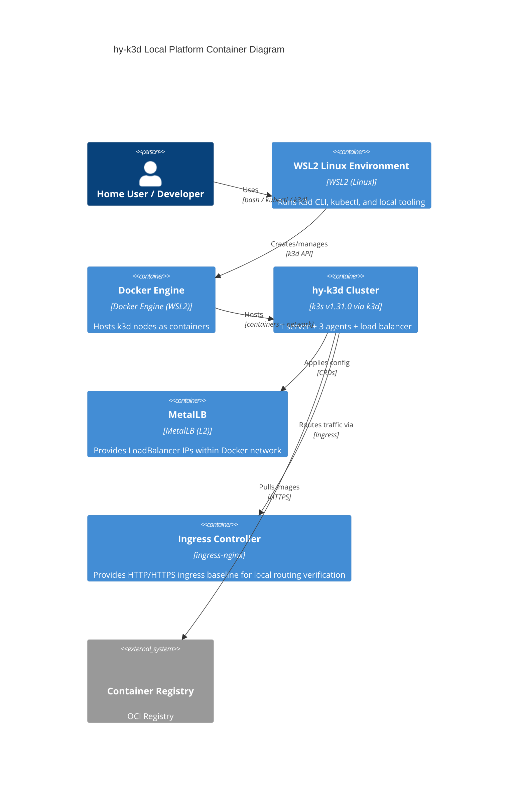

# Home Cluster Architecture Reference Document (ARD)

*Target Directory: `docs/ard/infra/k3d-cluster-requirements.md`*

- **Status**: Approved
- **Owner**: hy
- **PRD Reference**: [Link to PRD](../../../docs/prd/infra/home-cluster-infra-prd.md)
- **ADR References**: [Link to ADRs](../../../docs/adr/infra/0001-k3d-local-cluster.md)

---

## 1. Executive Summary

This document defines the high-level architecture for the local Kubernetes environment (`hy-k3d`) running on **WSL2**. It outlines the core components, technology stack, and non-functional requirements needed to support home automation and development services, including **GPU-accelerated** workloads.

## 2. Business Goals

- Provide a stable and reproducible k8s environment.
- Enable local testing of AI and home automation services.
- Minimize host resource impact while maximizing workload efficiency.

## 3. System Overview & Context

The `hy-k3d` cluster acts as the central execution engine for all localized services. It runs k3s nodes inside Docker containers managed by `k3d`, primarily for fast lifecycle operations and multi-node simulation.

## 4. Architecture & Tech Stack Decisions (Checklist)

*Ensure all mandatory fields are addressed based on `ARCHITECTURE.md`.*

### 4.0 Architecture Checklist Answers (ARCHITECTURE.md)

| Category | Check Question | Priority | Notes / Decisions |
| --- | --- | --- | --- |
| **Architecture Style** | Is the architectural style decided? | **Mandatory** | Infrastructure platform: Kubernetes-based local cluster (k3s distribution). |
| **Service Boundaries** | Are boundaries/responsibilities expressed? | **Mandatory** | Boundary: cluster lifecycle + base networking (k3d, MetalLB). Workloads are out of scope. |
| **Domain Model** | Are core entities and relations defined? | **Mandatory** | N/A (Infrastructure-only scope). |
| **Tech Stack (Backend)** | Backend language/framework/libs decided? | **Mandatory** | k3s + k3d + Docker Engine (WSL2-managed). |
| **Tech Stack (Frontend)** | Frontend framework/state/build decided? | **Mandatory** | N/A (No UI in this repo scope). |
| **Database** | Primary DB and schema strategy decided? | **Mandatory** | N/A (Cluster provides storage via local-path; app DBs are workload concerns). |
| **Messaging / Async** | Broker or async method defined? | *Optional* | N/A (Workload-specific). |
| **Infrastructure** | Deployment target decided? | **Mandatory** | WSL2 (Windows host) + WSL-managed Docker Engine + k3d cluster. |
| **Non-Functional Req** | NFRs defined quantitatively? | **Mandatory** | Defined in Section 8 (latency, availability, resource minimums). |
| **Scalability Strategy** | Scale-up/out strategy drafted? | *Optional* | Multi-node simulation (1 server + 3 agents); HPA/VPA are workload-level. |
| **Arch. Principles** | Principles incl. “what NOT to do”? | *Optional* | See Section 9 (no imperative edits; declarative manifests). |
| **ADR Management** | ADR process established? | *Optional* | Yes: `docs/adr/infra/` with template enforcement. |
| **Pillar Alignment** | Align with 6 pillars? | **Mandatory** | Addressed across Sections 6–9 (Security, Observability, Performance, Compliance, Documentation, Localization). |
| **Agent Rule Compliance** | Complies with `.agent/rules/`? | **Mandatory** | Yes (Spec-first, template-first). |

### 4.1 Component Architecture

The cluster follows a standard multi-node setup using Docker containers as nodes.

- **Server Node**: 1 Control Plane node (Master).
- **Agent Nodes**: 3 Worker nodes for workload isolation and redundancy.

### 4.2 Technology Stack

- **Backend**: N/A (Infrastructure-only).
- **Frontend**: N/A (Infrastructure-only).
- **Database**: N/A (Infrastructure-only; storage via local-path provisioner for PVCs).

Additional platform components:

- **Orchestration**: Kubernetes v1.31.0 (k3s distribution).
- **Engine**: k3d (k3s in Docker).
- **Host Platform**: Windows Subsystem for Linux (WSL2).
- **Container Runtime**: Docker Engine inside WSL2 (WSL-managed service).
- **Container Network**: Dedicated Docker network with fixed CIDR (to stabilize MetalLB IP allocation).
- **GPU Runtime**: NVIDIA Container Toolkit (optional; required for GPU workloads).
- **Load Balancer**: MetalLB (L2 Mode).
- **Ingress Layer**: ingress-nginx baseline (Traefik disabled in base config).

## 5. Data Architecture

- **Domain Model**: N/A (Infrastructure-only).
- **Storage Strategy**: Local volume mounts for persistent data inside WSL2 filesystem.
- **Data Flow**: Workloads (out of scope) consume PVCs via the default `local-path` StorageClass.

Constraints:

- Ensure data mounts stay within the WSL filesystem (`/home/...`) rather than Windows paths (`/mnt/c/...`) to avoid performance overhead and file permission quirks.

## 6. Security & Compliance

- **Authentication/Authorization**: Native Kubernetes auth via kubeconfig; RBAC used for least privilege in workloads (out of scope for base cluster bootstrap).
- **Data Protection**: Secrets stored as Kubernetes Secrets; avoid committing plaintext credentials to git.
- **Audit Logging**: Use Kubernetes events and component logs (`kubectl get events`, `docker logs`) as baseline; centralized audit logging is a later milestone.

Baseline hardening targets (future work unless already implemented):

- Use Pod Security Admission labels (`restricted`) for application namespaces by default.
- Apply default-deny NetworkPolicies for sensitive namespaces and explicitly allow required traffic.

## 7. Infrastructure & Deployment

- **Deployment Hub**: Local Host (Commodity Hardware).
- **Orchestration**: k3d (primary local cluster mode).
- **CI/CD Pipeline**: Out of scope for base cluster bootstrap; GitOps (ArgoCD/Flux) planned in later milestones.

Repository layout:

- Cluster config: `infrastructure/k3d/`
- MetalLB config: `infrastructure/ipaddresspool.yaml`

## 8. Non-Functional Requirements (NFRs)

- **Availability**: 99% (local hardware dependent; no HA control plane in local mode).
- **Performance (Latency)**: kube-apiserver response time target p95 < 10ms (local).
- **Throughput**: Capable of running 50+ low-to-medium resource services concurrently (subject to host resources).
- **Scalability Strategy**: Multi-node simulation (1 server + 3 agents). Scale-out beyond this is out of scope for local WSL2 mode.

## 9. Architectural Principles, Constraints & Trade-offs

- **What NOT to do**: Manual configuration via `kubectl edit` is discouraged; use manifests.
- **Constraints**:
  - Limited by host RAM and GPU VRAM.
  - WSL2 networking and resource limits are governed by `.wslconfig` (Windows host).
- **Considered Alternatives**: Kind, Minikube (documented in ADR-0001).
- **Chosen Path Rationale**: k3d offers superior performance and easy GPU integration.
- **Known Limitations**: Resource sharing with other Dockerized apps.

---

> [!TIP]
> This ARD avoids code-level details. For specific implementation logic, use the **Technical Specification** located in `specs/infra/spec.md`.
