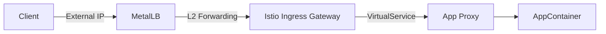

# Infrastructure Controllers

This document details the ingress and traffic management controllers that facilitate network entry into the `hy-home.k8s` cluster.

## 1. Physical/Layer 2 Access: MetalLB

In a bare-metal or home-lab environment (like Kind on Docker), there is no cloud LoadBalancer provider. We use **MetalLB** to emulate this behavior.

- **Mode**: Layer 2 (ARP/NDP)
- **Function**: Assigns a "real" IP address from a configured pool to services of type `LoadBalancer`.
- **IP Pool**: Configured in `IPAddressPool` resource. In the Kind setup, this usually maps to the docker bridge network CIDR.

## 2. Ingress Controller: Nginx

**Ingress Nginx** is the primary Kubernetes Ingress controller.

- **Role**: Handles standard HTTP/HTTPS routing based on Host/Path.
- **Service Type**: Exposed via MetalLB `LoadBalancer` service.
- **Classes**: It watches for Ingress resources with `ingressClassName: nginx`.

### Interaction with Istio

While Istio is present, Nginx can still be used for simple services or legacy ingress. However, in this architecture, we prefer routing traffic through the Istio Ingress Gateway for better observability and security.

## 3. Service Mesh Entry: Istio Ingress Gateway

The **Istio Ingress Gateway** is the preferred entry point for all application traffic.

- **Resource**: `Gateway` and `VirtualService`.
- **Function**:
  - TLS Termination (Managed by Cert-Manager).
  - Traffic Splitting (Canary/Blue-Green).
  - Header manipulation and Fault Injection.
- **Port Exposure**: The Gateway service itself is exposed as a `LoadBalancer` (via MetalLB), getting an external IP.

## 4. Traffic Flow

