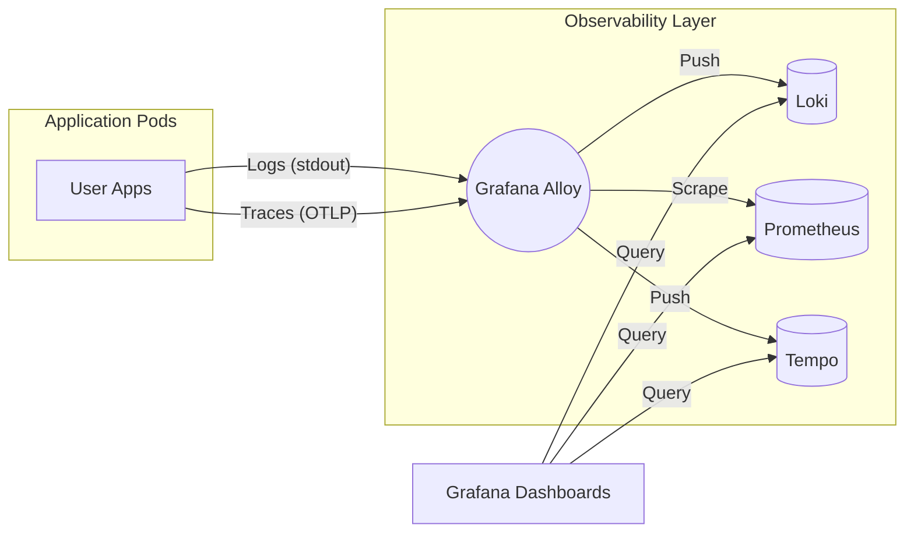

# Infrastructure: Observability Stack (LGTM)

The `hy-home.k8s` platform utilizes the **LGTM** stack (Loki, Grafana, Tempo, Mimir/Prometheus) for unified telemetry.

## 🏗️ Technical Architecture

We use a "push-based" model for most telemetry, centered around **Grafana Alloy**.

### 1. Unified Collector: Grafana Alloy

Instead of multiple agents (Promtail, Agent), we use **Grafana Alloy** as the single telemetry pipeline.

- **Log Processing**: Discovers Kubernetes pods, scrapes logs, and prefixes them with metadata before sending to Loki.
- **Metric Scraping**: Interfaces with the `kube-prometheus-stack` to collect node and pod metrics.
- **Tracing Pipeline**: Receives OTLP traces from applications and forwards them to Tempo.

---

## 📂 Components

### [Loki](../../infrastructure/observability/loki/)

- **Role**: Log aggregation system.
- **Storage**: Uses local storage (configured in `values.yaml`) for simplicity in home lab environments.
- **Query Language**: LogQL.

### [Prometheus (Kube-Prometheus-Stack)](../../infrastructure/observability/kube-prometheus-stack/)

- **Role**: Time-series database for metrics.
- **Features**: Includes Node Exporter, Kube-State-Metrics, and default Grafana dashboards.

### [Tempo](../../infrastructure/observability/tempo/)

- **Role**: Distributed tracing backend.
- **Integration**: Linked with Loki via `derived fields` to allow seamless transition from logs to specific request traces.

### [Grafana](../../infrastructure/observability/kube-prometheus-stack/)

- **Role**: The visualization layer.
- **Dashboards**: Pre-configured dashboards for Cluster Health, Node Resource Usage, and Istio Mesh performance.

---

## 🔄 Telemetry Flow

---

## 🛠️ Management

- **Persistence**: Managed via PersistentVolumeClaims (PVCs).
- **Retention**: Configured via Compactor/Retention policies in respective `values.yaml` files.
- **Alerting**: Integrated via Prometheus Alertmanager.
