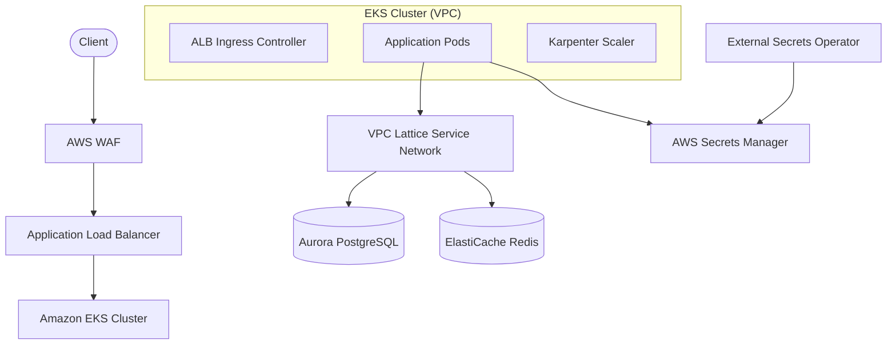

# AWS Cloud Native Reference Architecture (ARD)

## Overview (KR)

이 문서는 hy-home.k8s 시스템의 AWS 마이그레이션을 위한 참조 아키텍처를 정의한다. 2026-05-09 공식 지원 스냅샷 기준의 AWS 관리형 서비스와 Kubernetes 에코시스템을 결합하여, 운영 복잡성을 낮추고 보안성과 확장성을 극대화한 설계를 지향한다.

## Summary

본 아키텍처는 기존 K3s 환경의 모든 워크로드를 Amazon EKS로 이관하며, 데이터베이스(PostgreSQL), 캐시(Redis), 시크릿 관리 등을 AWS Managed Service로 대체한다. 네트워크 계층에서는 VPC Lattice를 도입하여 서비스 간 통신 보안을 강화하고, Karpenter를 통해 지능형 노드 관리를 수행한다.

## Boundaries & Non-goals

- **Owns**:
  - AWS VPC 및 서브넷 구조 (3-AZ).
  - Amazon EKS 클러스터 및 Karpenter 프로비저너.
  - RDS Aurora, ElastiCache Serverless 인스턴스.
  - AWS Secrets Manager 및 External Secrets Operator 설정.
- **Consumes**:
  - AWS IAM 기반의 권한 관리 (Pod Identity).
  - AWS Certificate Manager (ACM) 기반 SSL/TLS 인증서.
- **Does Not Own**:
  - 애플리케이션 소스 코드 자체.
  - 사용자 도메인 등록 (Route53 설정만 포함).
- **Non-goals**:
  - 온프레미스와의 Direct Connect 연결 구축.
  - 레거시 EC2 인스턴스 마이그레이션 (모든 서비스는 컨테이너화 전제).

## Quality Attributes

- **Performance**: Aurora Serverless v2를 통해 트래픽 급증 시 즉각적인 스케일업 지원. CloudFront/S3를 통한 정적 자서 속도 향상.
- **Security**: IAM Pod Identity 및 VPC Lattice를 통한 최소 권한 원칙(Least Privilege) 및 제로 트러스트 네트워킹 구현. 모든 데이터는 가용 영역 간 및 저장 시 암호화.
- **Reliability**: 클러스터 및 데이터 계층의 Multi-AZ 구성을 통한 고가용성(High Availability) 보장.
- **Scalability**: Karpenter를 활용한 초 단위 워커 노드 확장 및 축소.
- **Observability**: AWS Distro for OpenTelemetry(ADOT)를 통한 메트릭, 로그, 트레이스 통합 관리 (Managed Prometheus/Grafana 연동).

## System Overview & Context

## Data Architecture

- **Key Entities / Flows**: 모든 애플리케이션 시크릿 데이터는 AWS Secrets Manager에서 관리되며, ESO를 통해 Kubernetes Secret 객체로 미러링됨.
- **Storage Strategy**: 관계형 데이터는 Aurora PostgreSQL(Multi-AZ)에 저장하며, 비정형 데이터 및 백업은 S3에 저장. EBS CSI Driver를 통한 영구 볼륨 관리.
- **Data Boundaries**: 데이터베이스는 전용 Private Isolated Subnet에 배치되어 외부 접근을 차단함.

## Infrastructure & Deployment

- **Runtime / Platform**: Amazon EKS (Kubernetes v1.35+) 기반.
- **Deployment Model**: GitOps 기반 배포 (ArgoCD 유지). 인프라는 Terraform으로 프로비저닝.
- **Operational Evidence**: CloudWatch와 Managed Prometheus를 통한 24/7 모니터링 및 임계치 기반 알람 설정.

## Related Documents

- **PRD**: [../01.prd/2026-03-31-aws-migration-prd.md](file:///home/hy/project-infra/hy-home.k8s/examples/aws/docs/01.prd/2026-03-31-aws-migration-prd.md)
- **ADR**: [../03.adr/0001-aws-managed-services-selection.md](file:///home/hy/project-infra/hy-home.k8s/examples/aws/docs/03.adr/0001-aws-managed-services-selection.md)
- **Spec**: [../04.specs/aws-migration/spec.md](file:///home/hy/project-infra/hy-home.k8s/examples/aws/docs/04.specs/aws-migration/spec.md)
