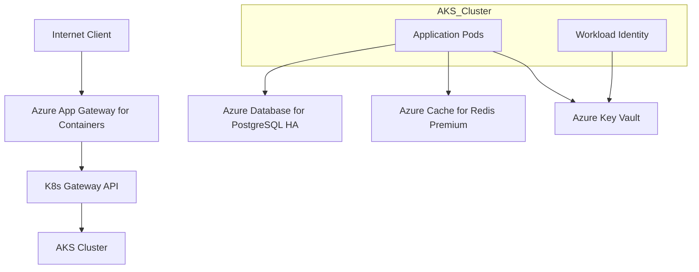

# Azure Migration ARD (Architecture Reference Document)

## Overview

본 문서는 로컬 k3s 인프라를 2026-05-09 공식 지원 스냅샷 기준 Azure(AKS) 클라우드 환경으로 마이그레이션하기 위한 참조 아키텍처를 정의한다. 시스템의 경계, 책임, 데이터 흐름, 핵심 품질 속성을 규정하며, 모든 인프라는 클라우드 네이티브 관리형 서비스를 최우선으로 활용한다.

## Summary

로컬 k3s/k3d 환경의 분산형 아키텍처를 Azure Kubernetes Service(AKS)와 Application Gateway for Containers(AGC) 및 Managed 서비스 계층으로 전환하여 운영 통합과 보안 거버넌스(Entra ID 통합)를 달성한다. 모든 통신은 Azure VNet 및 CNI Overlay 기술을 통해 안전하게 격리되며, 인증은 Workload Identity로 중앙화된다.

## Boundaries & Non-goals

- **Owns**:
  - AKS Cluster (1.35 target, Standard Tier)
  - VNet Architecture (Azure CNI Overlay)
  - AGC (Application Gateway for Containers) & Gateway API
  - Azure Database for PostgreSQL Flexible
  - Azure Cache for Redis & Azure Key Vault
- **Consumes**:
  - Entra ID (Identity Service)
  - Azure Container Registry (이미지 공급)
- **Does Not Own**:
  - Local Hardware Management (Decommissioned)
  - Multi-cloud Peering (Phase 2)
- **Non-goals**:
  - 온프레미스 노드와 클라우드 노드 간의 하이브리드 워크로드 믹스 (클라우드로의 완전 이전 지향)

## Quality Attributes

- **Performance**: 2026년 최신 Azure CNI Overlay 기술을 통해 대규모 Pod 스케일링 대응 및 초고속 노드 간 통신 보장.
- **Security**: Workload Identity 기반의 Passwordless 인증 체계 및 Key Vault CSI 통합 시크릿 관리.
- **Reliability**: Managed Database(Flexible Server) 및 Redis(Redundancy)의 99.9% 이상 가동률 보장.
- **Scalability**: VMSS(Virtual Machine Scale Set)와 AKS 오토스케일러를 통한 동적 자원 확장.
- **Observability**: Azure Monitor 및 Log Analytics 통합을 통한 실시간 지표 분석 및 추적.

## System Overview & Context

## Data Architecture

- **Key Entities / Flows**: 모든 애플리케이션 데이터는 AKS 내부가 아닌 Azure Managed Service에 영속화된다.
- **Storage Strategy**:
  - RDBMS: Azure Database for PostgreSQL Flexible Server (Zone-redundant HA).
  - Caching: Azure Cache for Redis (Premium P1).
  - Secrets: Azure Key Vault (Key Vault RBAC Authorized CSI Mode).
- **Data Boundaries**: AKS는 연산 계층으로만 격리하며, 상태(State)는 관리형 서비스 저장소에서 관리한다.

## Infrastructure & Deployment

- **Runtime / Platform**: Azure Kubernetes Service (AKS).
- **Deployment Model**:
  - Infrastructure: Azure Bicep (Modular Foundation).
  - Deployment: ArgoCD (GitOps Pull Model).
- **Operational Evidence**: Azure Resource Graph 및 Metrics Advisor를 통한 상태 리포팅.

## Related Documents

- **PARD**: [../01.requirements/2026-03-31-azure-migration.md](../../01.requirements/2026-03-31-azure-migration.md)
- **Spec**: [../03.specs/azure-migration/spec.md](../../03.specs/azure-migration/spec.md)
- **ADR**: [../02.architecture/decisions/0001-cni-overlay.md](../decisions/0001-cni-overlay.md)
- **ADR**: [../02.architecture/decisions/0002-agc-gateway-api.md](../decisions/0002-agc-gateway-api.md)
- **ADR**: [../02.architecture/decisions/0003-workload-identity.md](../decisions/0003-workload-identity.md)
- **ADR**: [../02.architecture/decisions/0004-postgresql-flexible-ha.md](../decisions/0004-postgresql-flexible-ha.md)
