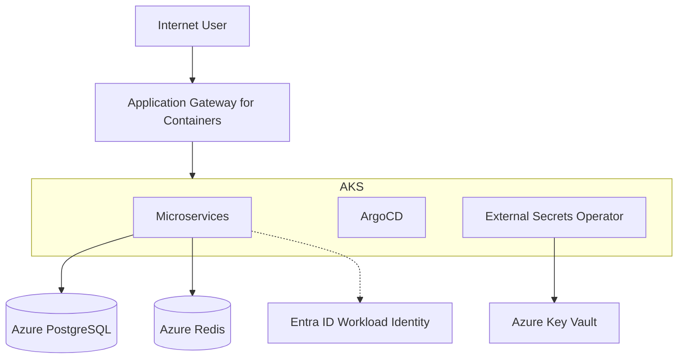

# Azure Kubernetes Service Reference Architecture (ARD)

## Azure Kubernetes Service Architecture Reference Document

## Overview (KR)

이 문서는 `hy-home.k8s` 인프라를 Azure AKS로 이전하기 위한 참조 아키텍처와 주요 품질 속성을 정의한다. 클러스터 네트워킹, 게이트웨이 전략, 관리형 서비스 연동 및 클라우드 네이티브 보안 모델을 포함한다.

## Summary

본 아키텍처는 가용성과 보안을 최우선으로 하며, 2026년 표준인 Gateway API(via AGC)와 Workload Identity를 핵심 구성 요소로 채택한다. 모든 인프라는 Bicep을 통해 선언적으로 관리된다.

## Boundaries & Non-goals

- **Owns**: AKS Cluster, VNet/Subnets, AGC, Azure PostgreSQL/Redis, Key Vault, ArgoCD (in-cluster).
- **Consumes**: Azure Entra ID (Identity), Azure Container Registry (Images), Azure Monitor (Metrics).
- **Does Not Own**: External DNS Providers (Cloudflare 등), On-premise Hardware.
- **Non-goals**: Multi-region DR 구성 (본 마이그레이션은 Single Region HA를 기본으로 함), Legacy VM 마이그레이션.

## Quality Attributes

- **Performance**: Azure CNI Overlay를 통한 파드 간 저지연 네트워킹 및 AGC를 통한 효율적인 L7 부하 분산.
- **Security**: Workload Identity를 사용한 Passwordless 인증 체계 및 Network Identity 기반의 리소스 접근 제어.
- **Reliability**: AKS Multi-AZ 구성 및 PostgreSQL Flexible Server의 High Availability 모드 적용.
- **Scalability**: Cluster Autoscaler 및 Virtual Kubelet(필요 시)을 통한 동적 워크로드 확장성 확보.
- **Observability**: Azure Monitor managed Prometheus 및 Managed Grafana 통합을 통한 상시 감시 체계.
- **Operability**: ArgoCD를 활용한 완전 자동화된 GitOps 배포 파이프라인.

## System Overview & Context

## Data Architecture

- **Key Entities / Flows**:
  - Application Service -> Azure Database for PostgreSQL (Application Data)
  - Application Service -> Azure Cache for Redis (Cache/Session Data)
- **Storage Strategy**: 스테이트리스 파드는 CSI 드라이버를 통해 Azure Disk(Standard/Premium SSD)를 사용하여 볼륨을 할당받음.
- **Data Boundaries**: 모든 데이터 저장소는 Private Endpoint 또는 VNet Integration을 통해 AKS 서브넷 내에서만 접근 가능하도록 격리됨.

## Infrastructure & Deployment

- **Runtime / Platform**: AKS (v1.30+), Ubuntu Node OS, Azure CNI Overlay.
- **Deployment Model**: GitOps 기반의 Push/Pull 모델 (Main 레파지토리 변경 시 ArgoCD가 클러스터에 반영).
- **Operational Evidence**: Bicep 배포 로그, Azure Activity Logs, AKS Control Plane Logs.

## Related Documents

- **PRD**: [../01.prd/2026-03-31-azure-migration-prd.md](../01.prd/2026-03-31-azure-migration-prd.md)
- **Spec**: [../04.specs/2026-03-31-resource-specs.md](../04.specs/2026-03-31-resource-specs.md)
- **Plan**: [../05.plans/2026-03-31-migration-strategy.md](../05.plans/2026-03-31-migration-strategy.md)
- **ADR**: [../03.adr/2026-03-31-adr-agc-selection.md](../03.adr/2026-03-31-adr-agc-selection.md)
