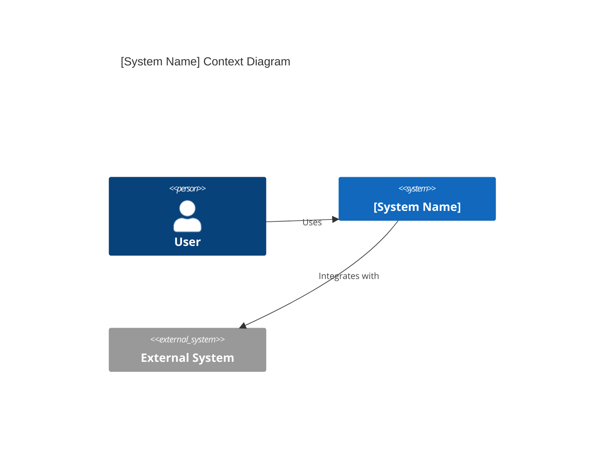
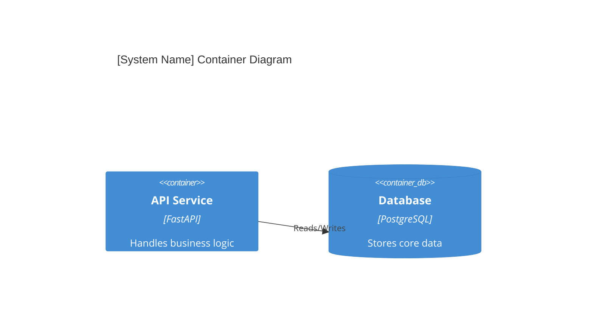

# [System/Service Name] Architecture Reference Document (ARD)

*Target Directory: `docs/ard/<system-name>-ard.md`*

- **Status**: [Draft | Review | Approved]
- **Owner**: [Name]
- **PRD Reference**: [Link to PRD]
- **ADR References**: [Link to ADRs]

---

## 1. Executive Summary

[Provide a high-level overview of the system/service, its purpose, and the problem it solves. This section is targeted at stakeholders and architects.]

## 2. Business Goals

[What are the top-level business or product objectives this architecture must support?]

## 3. System Overview & Context

[Describe how this system fits into the larger ecosystem. Use a C4 Context diagram to show external dependencies and users.]

## 4. Architecture & Tech Stack Decisions (Checklist)

*Ensure all mandatory fields are addressed based on `ARCHITECTURE.md`.*

### 4.1 Component Architecture

[Detail the internal structure of the system. Modular boundaries, key services, and interaction patterns.]

### 4.2 Technology Stack

- **Backend**: [Language, Framework, ORM]
- **Frontend**: [Framework, State Management, Build Tools]
- **Database**: [Primary DB Engine, Schema Strategy]

## 5. Data Architecture

- **Domain Model**: [Describe core entities and their relationships]
- **Storage Strategy**: [Rationale for chosen DBs, caching, and persistence]
- **Data Flow**: [How data moves through the system, especially async flows/messaging]

## 6. Security & Compliance

- **Authentication/Authorization**: [Brief overview, link to details in Spec]
- **Data Protection**: [Encryption, PII handling]
- **Audit Logging**: [Key events captured for compliance]

## 7. Infrastructure & Deployment

- **Deployment Hub**: [Cloud vs On-Prem, Serverless vs Containers/K8s]
- **Orchestration**: [Docker, K8s, etc.]
- **CI/CD Pipeline**: [Brief overview of the deployment flow]

## 8. Non-Functional Requirements (NFRs)

[Must be quantified dynamically.]

- **Availability**: [e.g., 99.9% uptime SLA]
- **Performance (Latency)**: [e.g., p95 < 200ms]
- **Throughput**: [e.g., Max 10k RPS]
- **Scalability Strategy**: [Partitioning, Caching, Scale-out tactics]

## 9. Architectural Principles, Constraints & Trade-offs

- **What NOT to do**: [e.g., No direct DB access from frontend controllers]
- **Constraints**: [External factors limiting choices, e.g., budget, existing monolithic database, team expertise.]
- **Considered Alternatives**: [What other paths were explored?]
- **Chosen Path Rationale**: [Why this design over others?]
- **Known Limitations**: [What are the current trade-offs?]

---

> [!TIP]
> This ARD should avoid code-level details. For specific implementation logic, use the **Technical Specification** template.
