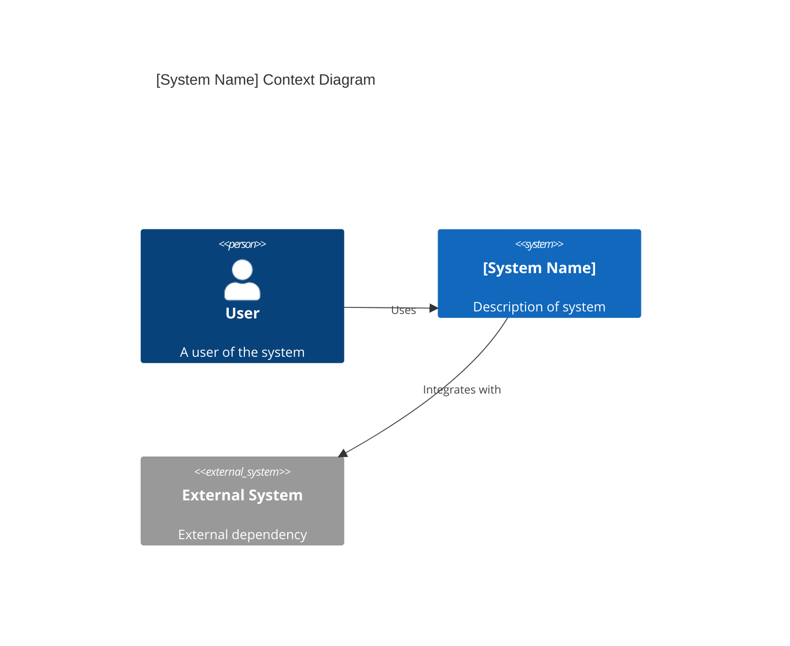
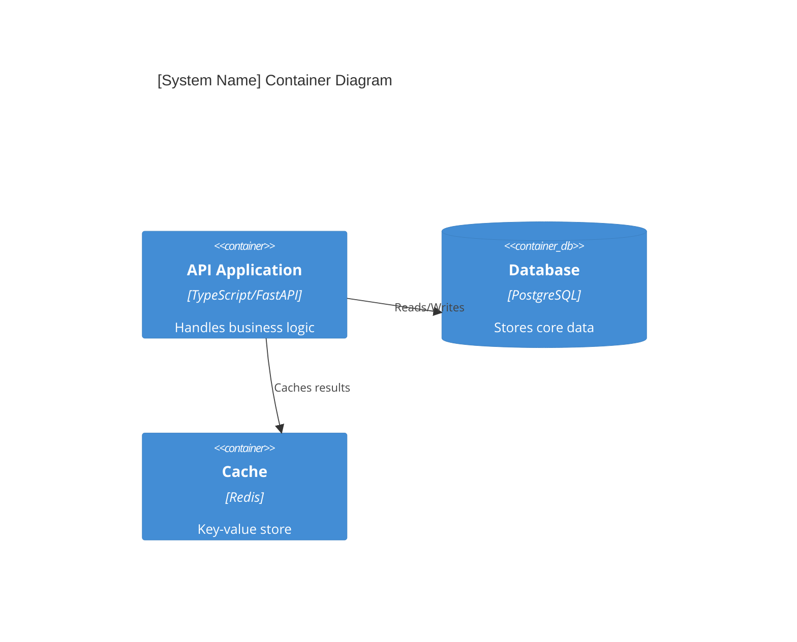

# Architecture Reference Document (ARD)

_Target Location: `docs/ard/YYYY-MM-DD-<system-or-domain>.md`_
_Description: This document serves as the canonical technical authority for a system or domain boundary. It defines the 'What' and 'Why' of the architecture, leaving the 'How' to Implementation Specs._

## Overview (KR)
이 문서는 특정 시스템 또는 도메인의 아키텍처 표준을 정의합니다. 시스템의 경계, 상호작용 모델, 그리고 주요 아키텍처 결정을 포함하며 전체 플랫폼 내에서의 역할을 명시합니다.

---

## 1. Metadata & Status

- **Status**: [Approved | Superseded | Deprecated]
- **Owner**: [Repository Owner / Team]
- **Scope**: [master | domain | historical]
- **layer:** [meta | infra | gitops | app | ops]
- **PRD Reference**: `[../prd/feature-or-system-prd.md]`
- **ADR References**: `[../adr/NNNN-decision.md]`

## 2. System Boundaries & Ownership

- **Owns**: [e.g., User authentication state, Session management]
- **Consumes**: [e.g., Postgres DB, Redis Cache, External Auth0 API]
- **Does Not Own**: [e.g., User profile images (owned by Storage Domain)]

## 3. Architecture Context (C4 Model)

### 3.1 Level 1: System Context
_How the system interacts with users and other systems._

### 3.2 Level 2: Containers
_High-level technical building blocks (Apps, DBs, Microservices)._

## 4. Technical Stack & Integrity

- **Backend / Platform**: [e.g., Node.js 22, K8s]
- **Cross-Cutting Concerns**: 
  - **Auth**: [e.g., JWT-based RBAC]
  - **Logging**: [e.g., Structured JSON with OpenTelemetry]
  - **Concurrency**: [e.g., Optimistic locking on State field]

## 5. Resilience & Scalability (Senior)

### 5.1 Failure Modes & Mitigation
| Scenario | Impact | Mitigation Strategy |
| :--- | :--- | :--- |
| **DB Timeout** | API 500s | Circuit Breaker + Retry Policy |
| **Auth Service Down** | Login blocked | Graceful degradation (Cache if possible) |
| **Cache Miss Storm** | Latency spike | Request collapsing / Locking |

### 5.2 Scaling Triggers
- **Vertical Scale**: [e.g., Memory usage > 80% for 5m]
- **Horizontal Scale (HPA)**: [e.g., Concurrent requests > 200 per pod]

## 6. Data Architecture & Persistence

- **Domain Entities**: [List key models/tables]
- **Consistency Model**: [e.g., Eventual Consistency via MQ / Strong Consistency via SQL]
- **Data Retention**: [e.g., PII deleted after 90 days, Logs retained for 1 year]

## 7. Operational Roadmap
- **Deployment**: [e.g., Zero-downtime Rolling Update]
- **Observability**: [Link to Dashboards / SLOs in Operation Manual]
- **Runbook**: `[../runbooks/system-runbook.md]`
