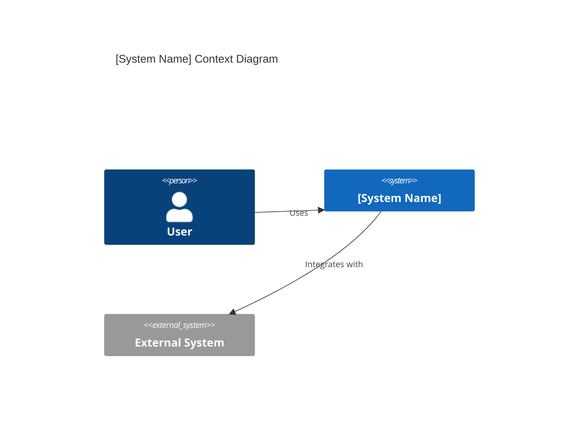
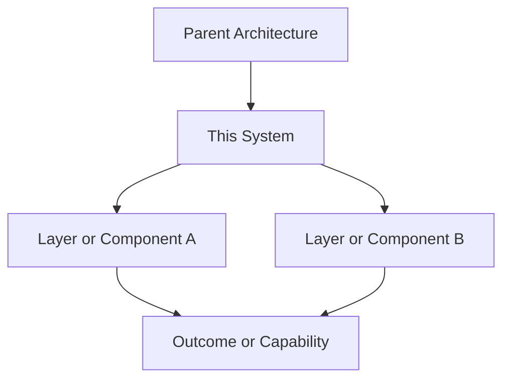

# [System or Domain Name] Architecture Reference Document (ARD)

> Use this template for `docs/ard/<system-or-domain>-ard.md`.
>
> Repository-derived contract:
>
> - Use exactly one meaningful H1.
> - Use relative links only.
> - Remove every placeholder before saving.
> - Keep ARDs architectural. File-level implementation detail belongs in the Spec.
> - Allowed ARD status values: `Approved | Superseded | Deprecated`.
> - Allowed scope values where your doc set uses them: `master | domain | historical`.
> - Allowed scope values layer values: `common | architecture | backend | frontend | infra | mobile | product | qa | security`
> - `domain` documents should name their parent master ARD where applicable.
> - Keep all structural and narrative content in English.
> - Add exactly one `Overview (KR)` summary near the top. That overview summary alone should be written in Korean.
>
> Shape guidance:
>
> - Use the extended architecture form for `content/` and `vault/` system documents.
> - Use the compact architecture form for focused `web/` active-chain ARDs where the architecture boundary is intentionally compressed into summary, rules, and ownership.

## Optional Frontmatter

```yaml
---
title: '[System or Domain Name] Architecture Reference Document'
status: 'Approved'
owner: 'buenhyden'
scope: 'master'
parent_ard: '../ard/system-master-ard.md'
prd_reference: '../prd/feature-or-system-prd.md'
tags: ['ard', '<topic>']
layer: '<layer>'
---
```

## H1 and Metadata

# [System or Domain Name] Architecture Reference Document

- **Status**: [Approved | Superseded | Deprecated]
- **Owner**: [Repository Owner]
- **Scope**: [master | domain | historical]
- **layer:** [common | architecture | backend | frontend | infra | mobile | product | qa | security]
- **Parent Master ARD**: `[../ard/system-master-ard.md]` (Optional for `master`)
- **PRD Reference**: `[../prd/feature-or-system-prd.md]`
- **ADR References**: `[../adr/NNNN-decision.md]`, `[../adr/NNNN-decision-2.md]`

**Overview (KR):** [Write a 1-2 sentence Korean summary of the architecture boundary, the system role, and how it relates to the wider platform.]

## Required Core Sections

These sections must exist even in the compact form.

## Summary

[Summarize what this system or domain is, what boundary it owns, and how it relates to the wider platform.]

## Boundaries

- **Owns**: [Boundary, responsibility, or source of truth]
- **Consumes**: [Upstream dependency, data source, or policy input]
- **Does Not Own**: [Boundary explicitly outside this ARD]

## Ownership

- **Primary owner**: [Repository Owner or maintainer]
- **Primary artifacts**: `[path/to/dir]`, `[path/to/file]`
- **Operational evidence**: `[../operations/incidents/]`, `[../runbooks/]`, or `N/A`

## Related

- `[../prd/feature-or-system-prd.md]`
- `[../specs/YYYY-MM-DD-feature.md]`
- `[../plans/YYYY-MM-DD-feature.md]`
- `[../adr/NNNN-decision.md]`

## Optional Extended Sections

Add these when the document is a canonical architecture reference rather than a compact active-chain summary.

## 1. Executive Summary

[Summarize what this system or domain is, what boundary it owns, and how it relates to the wider platform.]

## 2. Business Goals

- [Business goal 1]
- [Business goal 2]
- [Business goal 3]

## 3. System Overview & Context

[Describe where this system fits, which users or maintainers interact with it, and which upstream or downstream systems it depends on.]



## 4. Architecture & Tech Stack Decisions

### 4.1 Component Architecture

[Describe internal layers, boundaries, and delegation rules.]



### 4.2 Technology Stack

- **Runtime / Frontend / Platform**: [For example: Next.js 16, React 19, Tailwind CSS v4]
- **Content / Config / Generated Artifacts**: [For example: Markdown, TOML, generated JSON]
- **Verification / Delivery**: [For example: lint, build, smoke tests, static hosting]

## 5. Data Architecture

- **Domain Model**: [Describe the key entities, concepts, or contracts]
- **Storage Strategy**: [Describe where data, config, or generated artifacts live]
- **Data Flow**: [Describe how data moves through the system]

## 6. Security & Compliance

- **Authentication / Authorization**: [Describe the auth boundary or state that it is not applicable]
- **Data Protection**: [Describe any separation, handling rule, or constraint]
- **Audit Logging / Traceability**: [Describe the evidence or traceability path]
- **Accessibility / Localization**: [Describe the required accessibility or locale considerations]

## 7. Infrastructure & Deployment

- **Deployment Hub**: [For example: GitHub Pages static export]
- **Orchestration**: [For example: build pipeline, generated artifacts, container workflow]
- **CI/CD Pipeline**: [How verification and delivery work]

## 8. Non-Functional Requirements (NFRs)

- **Availability**: [Target or N/A]
- **Performance**: [Target, principle, or "no runtime change"]
- **Throughput / Scale**: [Target or scaling assumption]
- **Scalability Strategy**: [How growth is handled]

## 9. Architectural Principles, Constraints & Trade-offs

- **What NOT to do**:
  - [Anti-pattern 1]
  - [Anti-pattern 2]
- **Constraints**:
  - [Constraint 1]
  - [Constraint 2]
- **Considered Alternatives**:
  - [Alternative summary]
- **Chosen Path Rationale**:
  - [Explain why this path was chosen]
- **Known Limitations**:
  - [List the current limits or deferred concerns]

## 10. Source-of-Truth Map

| Scope   | Canonical Document                            | Role                             |
| ------- | --------------------------------------------- | -------------------------------- |
| master  | `docs/ard/system-master-ard.md`    | Top-level architecture authority |
| domain  | `docs/ard/domain-ard.md`           | Subordinate domain architecture  |
| feature | `docs/specs/YYYY-MM-DD-feature.md` | Implementation detail            |

## 11. Legacy Document Traceability

| Existing Document                       | New Relationship            |
| --------------------------------------- | --------------------------- |
| `docs/ard/old-system-ard.md` | Superseded by this document |
