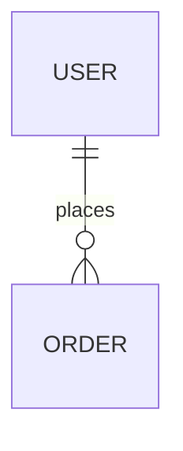

# Implementation Specification (Spec)

> **Status**: Draft / Implementation / Validated
> **Related PRD**: [Link to PRD]
> **Related API Spec**: [Link to API Spec if applicable]
> **Related Architecture**: [Link to ARCHITECTURE.md](../../ARCHITECTURE.md)

*Target Directory: `specs/<feature>/spec.md`*
*Note: This document is the absolute Source of Truth for Coder Agents. NO CODE can be generated without it.*

---

## 0. Pre-Implementation Checklist (Governance)

> **Mandatory**: Coder agents MUST verify these checklists before generating code.

### 0.1 Architecture / Tech Stack

| Item               | Check Question                                        | Required | Alignment Notes | Where to document |
| ------------------ | ----------------------------------------------------- | -------- | --------------- | ----------------- |
| Architecture Style | Is the style Monolith/Modular Monolith/Microservices? | Must     |                 | Section 1         |
| Service Boundaries | Are module boundaries documented (diagram/text)?      | Must     |                 | Section 1         |
| Domain Model       | Are core domain entities and relationships defined?   | Must     |                 | Section 3         |
| Backend Stack      | Are language/framework/libs (web, ORM, auth) decided? | Must     |                 | Section 1         |
| Frontend Stack     | Are framework/state/build tools decided?              | Must     |                 | Section 1         |

### 0.2 Quality / Testing / Security

| Item            | Check Question                                     | Required | Alignment Notes | Where to document       |
| --------------- | -------------------------------------------------- | -------- | --------------- | ----------------------- |
| Test Strategy   | Levels (Unit/Integration/E2E/Load) defined?        | Must     |                 | Section 7               |
| Test Tooling    | Agreed framework/runner and mock strategy?         | Must     |                 | Section 7               |
| Coverage Policy | Are goals defined as numbers (e.g. 100%)?          | Must     |                 | Section 7               |
| AuthN/AuthZ     | Is auth approach designed (token/OAuth/RBAC)?      | Must     |                 | Section 4               |
| Data Protection | Encryption/access policies for sensitive data?     | Must     |                 | Section 9               |
| Performance     | Are Core Web Vitals/Latency metrics targeted?      | Must     |                 | Section 8               |
| Accessibility   | Is WCAG compliance integrated (contrast/ARIA)?     | Must     |                 | Section 8               |

### 0.3 Operations / Deployment / Monitoring

| Item           | Check Question                                           | Required | Alignment Notes | Where to document |
| -------------- | -------------------------------------------------------- | -------- | --------------- | ----------------- |
| Environments   | Are tiers (dev/staging/prod) clarified for this feature? | Must     |                 | OPERATIONS.md     |
| Logging        | Required structured logs defined (fields, IDs)?          | Must     |                 | Section 9         |
| Monitoring     | Metrics and dashboards defined (RED/USE)?                | Must     |                 | Section 9         |
| Alerts         | Are alert thresholds and routing defined?                | Must     |                 | Section 9         |
| Backups        | Are backup policies defined for added data?              | Must     |                 | Section 9         |

---

## 1. Technical Overview & Architecture Style

[Provide a concise technical summary of what will be coded to satisfy the PRD user stories. Describe the chosen high-level implementation strategy.]

- **Component Boundary**: [What this component owns and handles]
- **Key Dependencies**: [List significant upstream/downstream deps]
- **Tech Stack**: [Specific libraries and frameworks to be used]

## 2. Coded Requirements (Traceability)

[Map specific technical requirements to their parent PRD requirements.]

| ID                | Requirement Description | Priority | Parent PRD REQ |
| ----------------- | ----------------------- | -------- | -------------- |
| **[REQ-SPC-001]** | [Functional logic]      | High     | REQ-PRD-FUN-01 |
| **[SEC-SPC-001]** | [Security constraint]   | Critical | N/A            |

## 3. Data Modeling & Storage Strategy

[Describe how data will be persisted. Provide schema models and ER diagrams if applicable.]

- **Database Engine**: [e.g., PostgreSQL, Redis]
- **Schema Strategy**: [e.g., Relational tables, Document structure]
- **Migration Plan**: [How to handle data migrations]



## 4. Interfaces & Data Structures

[Provide exact interfaces, JSON payloads, or data models the Developer Agent must follow.]

### 4.1. Core Interfaces

```typescript
// Example interface
interface User {
  id: string;
  name: string;
}
```

### 4.2. AuthN / AuthZ (Required if protected data/actions)

- **Authentication**: [Session cookie / JWT / OAuth/OIDC / API key]
- **Authorization**: [RBAC/ABAC ownership checks, permission model]
- **Sensitive Endpoints/Actions**: [List actions requiring strict access]

## 5. Component Breakdown

[List the specific files or modules that need to be created or modified based on the architecture.]

- **`src/example/file1.ts`**: [What it does, new functions to add, dependencies]
- **`src/example/db.sql`**: [Schema changes]

## 6. Edge Cases & Error Handling

[List known error states and how the code should handle them.]

- **Error 1**: [Condition] -> [Expected Output / Fallback]
- **Error 2**: [Condition] -> [Expected Output / Fallback]

## 7. Verification Plan (Testing & QA)

[Explicitly define the test boundaries. Coder Agents refer to this to hit the 80% coverage mark.]

- **[VAL-SPC-001] Unit Tests**: [Identify functions/classes needing isolation testing targeting edge cases from Section 6.]
- **[VAL-SPC-002] Integration Tests**: [Identify API endpoints or DB transactions that must be tested connected.]
- **[VAL-SPC-003] E2E Tests (Optional)**: [Identify UI flows requiring browser/E2E testing matching PRD criteria.]
- **[VAL-SPC-004] Coverage**: [Target numbers + how measured]

## 8. Non-Functional Requirements (NFR) & Scalability

- **Performance / Latency**: [e.g., Response time < 200ms for 95th percentile]
- **Throughput**: [e.g., Support 1000 requests per second]
- **Scalability Strategy**: [e.g., Horizontal pod autoscaling, Redis caching]

## 9. Operations & Observability

- **Deployment Strategy**: [e.g., Rolling update, Blue-Green, Canary]
- **Monitoring & Alerts**: [Specify key metrics and alert thresholds]
- **Logging**: [Specific structured logs required for this feature, correlation IDs]
- **Data Protection**: [Backup schedule and RPO/RTO goals]
- **Sensitive Data Handling**: [PII/Secrets, encryption, controls]
