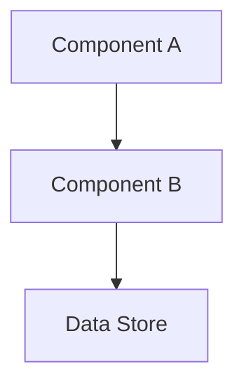

# {Project or Folder Name}

<!-- ROOT ONLY: Badges and high-level status -->
<!--


-->

> {A concise one-line description that clearly states the purpose of this project or directory.}

## Overview

{Provide a brief paragraph explaining what problem this project/folder solves, its target audience, and key features.}

<!-- ROOT ONLY: High-level technical summary -->
## Tech Stack

| Category   | Technology                        |
| ---------- | --------------------------------- |
| Language   | {TypeScript / Python / Go / etc.} |
| Framework  | {k3s / ArgoCD / etc.}             |
| Database   | {PostgreSQL / etc.}               |
| Deployment | {k3d / Flux / etc.}               |

---

## Scope & Context (Folder Only)

<!-- FOLDER ONLY: Define the boundaries and responsibilities of this specific directory -->
- **Purpose**: {What is the primary role of this folder?}
- **Layer**: {Which architectural layer does this belong to (infra, app, etc.)?}
- **Relationship to Root**: {How does this interact with the global system?}

## Prerequisites (Root Only)

- {Tool} >= {Version}
- {Tool} >= {Version}

## Quick Start (Root or Feature Entry)

### 1. {First Step}
```bash
{command}
```

### 2. {Second Step}
```bash
{command}
```

---

## Technical Reference

### Architecture
{Describe the architecture or component boundaries. Use Mermaid diagrams where helpful.}



### Request Lifecycle / Data Flow
1. {Step 1}
2. {Step 2}

### Database / Schema (If applicable)
{List key tables or entities.}

---

## Project Structure

<!-- ROOT ONLY: Comprehensive structure -->
<!--
```text
.
├── .agent/             # AI Agent rules, workflows, and prompts
├── docs/               # Project documentation (ADR, PRD, Specs)
├── infrastructure/     # Host and cluster configurations (Terraform, k3d)
├── gitops/             # ArgoCD application manifests
├── app/                # Application logic and manifests
├── scripts/            # Automation and utility scripts
├── templates/          # Standardized templates
└── README.md           # This file
```
-->

<!-- FOLDER ONLY: Local structure -->
```text
{folder-name}/
├── {subfolder}/        # {description}
├── {file}.yaml         # {description}
└── README.md           # This file
```

---

## Operations

### Available Scripts
| Command | Description |
| ------- | ----------- |
| `{script}` | {description} |

### Configuration
| Variable | Required | Description |
| -------- | -------- | ----------- |
| `{VAR_NAME}` | {Yes/No} | {description} |

### Testing
```bash
{test-command}
```

### Deployment
```bash
{deploy-command}
```

---

## Extensibility & Governance

Before contributing, read the governing documents:

- [🤖 Multi-Agent Governance](./AGENTS.md) (or relative path to root)
- [🏛️ System Architecture](./ARCHITECTURE.md) (or relative path to root)
- [📝 Specifications](./docs/specs/) (or relative path to root)

## Troubleshooting
{Common issues and their resolutions.}

## License
{License details}
