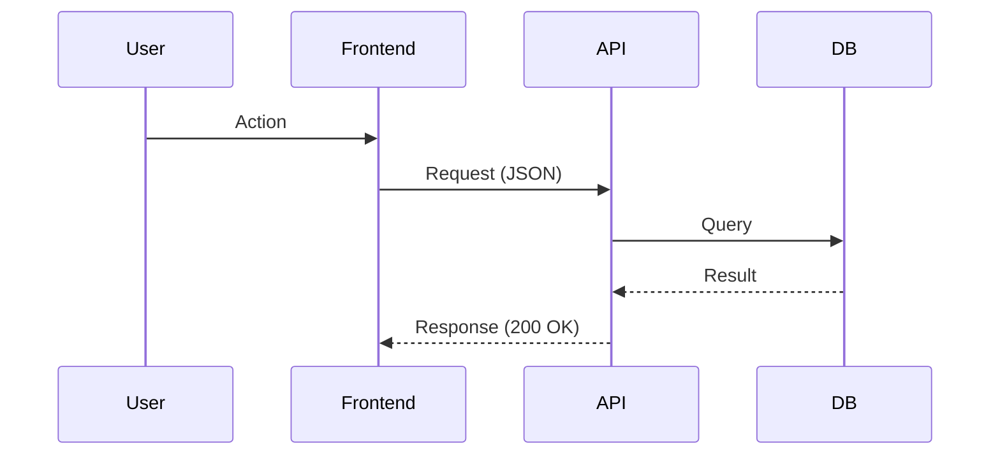

# Technical Specification (SPEC.md)

_Target Location: `docs/specs/YYYY-MM-DD-<feature-name>.md`_
_Description: This document defines the 'How' of a feature implementation. It bridges the Gap between the ARD (What/Why) and the Plan (Execution Steps)._

## Overview (KR)
이 문서는 특정 기능이나 시스템의 구체적인 기술 구현 방안을 정의합니다. 데이터 모델, 인터페이스 명세, 그리고 구현 시 고려해야 할 예외 상황과 검증 계획을 포함합니다.

---

## 1. Metadata & Traceability

- **Status**: [Canonical | Implementation | Validated]
- **layer**: [meta | infra | gitops | app | ops]
- **PRD Reference**: `[../prd/feature-prd.md]`
- **ARD Reference**: `[../ard/system-ard.md]`
- **ADR Reference**: `[../adr/NNNN-decision.md]`

## 2. Technical Baseline & Dependencies

- **Platform**: [e.g., Next.js 15, FastAPI, K8s]
- **Core Dependencies**: [List key libraries or services required]
- **Infrastructure Requirements**: [e.g., New Redis cluster, S3 bucket policy change]

## 3. Implementation Logic & Data Flow

### 3.1 Data Flow Diagram


### 3.2 Core Algorithms / Logic
[Explain complex logic, state transitions, or mathematical formulas here.]

## 4. Implementation Ledger (Component Breakdown)

| Component / File | Responsibility | Planned Change | Status |
| :--- | :--- | :--- | :--- |
| `src/components/X.tsx` | UI Layer | Add [Feature] support | [Pending] |
| `src/api/Y.ts` | Logic Layer | Implement [API Endpoint] | [Pending] |
| `infra/k8s/Z.yaml` | Infra | Define [Resource] | [Pending] |

## 5. Edge Case & Error Matrix (Senior)

| Condition | Expected Behavior | Error Code / Log |
| :--- | :--- | :--- |
| **Network Timeout** | Retry twice then 504 | `ERR_TIMEOUT` |
| **invalid Input** | Return 400 with details | `ERR_VALIDATION` |
| **Concurrency Clash** | Use optimistic locking | `ERR_CONFLICT` |

## 6. Verification & Quality Plan

### 6.1 Automated Testing
- **Unit Tests**: Mandatory for [Components]
- **Integration Tests**: Verify [Service A] to [Service B] connection.
- **E2E Tests**: Path: [Action -> Result]

### 6.2 Manual Verification
```bash
# Command to verify build
npm run build 

# Command to verify linting
npm run lint
```

## 7. Operations & Rollout
- **Feature Flag**: [Yes/No] - Tag: `feature_x`
- **Migration**: [e.g., Add `new_field` with default `null`]
- **Observability**: New dashboard for [Metric X]
